<p align="center">
  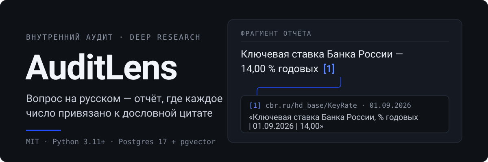
</p>

<div align="center">

# AuditLens

**Платформа исследований для внутреннего аудита банковских продуктов.** Вопрос на русском — аналитический отчёт со ссылками на первоисточники, графиками и PDF за 1–3 минуты. Каждое число привязано к дословной цитате со страницы, которую система действительно прочитала.

[](LICENSE)
[](https://www.python.org/downloads/)
[](https://github.com/pgvector/pgvector)

[Быстрый старт](#-быстрый-старт-5-минут) · [Онбординг разработчика](docs/ONBOARDING.md) · [Документация](docs/) · [Архитектура](docs/ARCHITECTURE.md) · [Troubleshooting](docs/TROUBLESHOOTING.md)

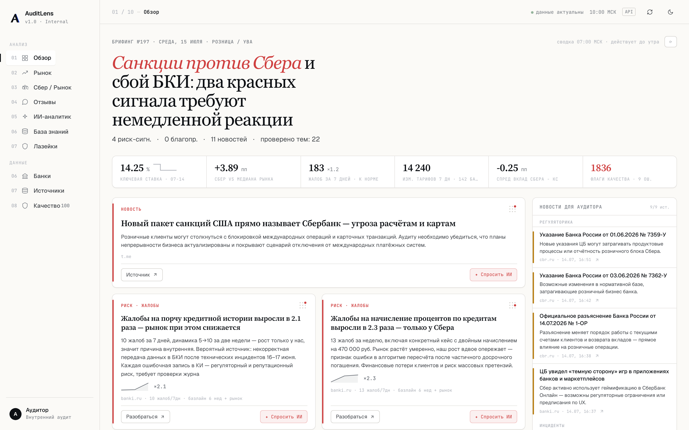

</div>

---

## 🎯 Для кого

**Аналитики и аудиторы банковского сектора**, которым нужно регулярно сравнивать продукты разных банков, искать данные по ставкам/тарифам/жалобам клиентов и готовить отчёты для руководства. AuditLens заменяет ручной обзвон 5–10 сайтов банков, копирование цифр в Excel и склеивание в Word — на один запрос на русском языке.

**Принцип, на котором построена система:** числа считает детерминированный код, LLM только формулирует. Всё, что модель могла бы выдумать, сверяется с фактами — а графики и сравнительные таблицы строятся вообще без LLM.

---

## ⚡ Что умеет

<table>
<tr>
<td width="50%" valign="top">

### 📰 Обзор — ежедневный брифинг
Утренний выпуск для аудитора: передовица, «пульс дня» из 6 метрик, риск-карточки с механикой «Разобраться» и «Спросить ИИ».

Все числа — детерминированный SQL. **3 LLM-вызова в сутки на всех** — генерится раз в день и кэшируется.

</td>
<td width="50%" valign="top">

### 🔬 Deep Research
**Кондуктор** разбирает вопрос (интент, субъекты, что считать раскрытым), дальше движок ведёт прогон: подзапросы → поиск → чтение страниц → сжатие → отчёт.

Из прочитанного извлекаются **типизированные факты с дословной цитатой** — они, а не свободный текст, попадают в отчёт. Типичное время — **1–3 мин**, первые строки появляются через пару секунд.

</td>
</tr>
<tr>
<td width="50%" valign="top">

### 🛡 Anti-hallucination
Эшелонированная защита:
- числа берутся только из прочитанной страницы, не из сниппетов выдачи
- каждый факт несёт **дословную цитату**, а критик работает в два слоя: дешёвый подтверждает точное совпадение и снимать не вправе, остаток судит модель — пересказ синонимами не ложь
- утверждения без опоры на источник из отчёта убираются, невалидные `[N]` вычищаются
- **графики и таблицы считаются без LLM** — числа физически не могут галлюцинировать

</td>
<td width="50%" valign="top">

### 📚 Цитаты и trust scoring
Каждое утверждение в отчёте имеет ссылку `[N]` на источник.

Trust-классы: 🟢 регуляторы (cbr.ru, pravo.gov.ru — 0.98), 🟡 банки (0.95), 🟠 агрегаторы (0.65), 🔴 блоги (исключаются).

</td>
</tr>
<tr>
<td width="50%" valign="top">

### 💬 Отзывы — риск-радар
Корпус ~390 тыс. негативных отзывов banki.ru, **21 тема / 145 regex-паттернов** в классах риска compliance / conduct / ops.

Спайк-детект на **медиане + MAD** (устойчиво к самому пику), гео-аномалии per-100k, Сбер vs рынок.

</td>
<td width="50%" valign="top">

### 🕳 Лазейки
Отдельный агент (nanobot-ai) ищет схемы, которыми клиенты и ИП обходят комиссии и лимиты.

Доменная таксономия ~40 схем, маскировка ПД перед отправкой в LLM, находки сохраняются в таблицу с дедупом.

</td>
</tr>
<tr>
<td width="50%" valign="top">

### 📊 Графики и PDF
Автоматическая визуализация числовых сравнений через Chart.js.

PDF-экспорт через Playwright Chromium — A4, embedded шрифты, графики, источники.

</td>
<td width="50%" valign="top">

### 🧠 Universal product support
Работает с **любым** банковским продуктом без хардкода: кондуктор сам определяет тему, синонимы, субъектов и нужны ли источники регулятора (НПА, ЦБ). Списков слов в парсере и индексаторе нет.

</td>
</tr>
</table>

---

## 🚀 Быстрый старт (5 минут)

### Что нужно

| | Где взять |
|---|---|
| **Python 3.11+** | `brew install python@3.12` (mac) · `sudo apt install python3.12` (Linux/WSL) |
| **Docker Desktop** | [Mac (Apple Silicon)](https://desktop.docker.com/mac/main/arm64/Docker.dmg) · [Mac (Intel)](https://desktop.docker.com/mac/main/amd64/Docker.dmg) · [Windows](https://desktop.docker.com/win/main/amd64/Docker%20Desktop%20Installer.exe) · [Linux](https://docs.docker.com/engine/install/) |
| **Git** | `brew install git` (mac) · `sudo apt install git` (Linux/WSL) |
| **Ключ к LLM** | любой **OpenAI-совместимый** эндпоинт. Для локального старта проще всего [fireworks.ai](https://fireworks.ai/) (бесплатные $15). В проде — Foundation Models Cloud.ru |

### Шаги (TL;DR)

```bash
# 1. Скачать
git clone https://github.com/SashaEee/auditLens.git
cd auditLens

# 2. Один скрипт = всё установлено (Docker, БД, Python deps, миграции)
bash scripts/setup.sh

# 3. Впиши ключ и эндпоинт в .env
open -e .env       # mac (откроет TextEdit)
# или: nano .env   # любая ОС (Ctrl+X для выхода)
#   LLM_BASE_URL=...   LLM_API_KEY=...   LLM_MODEL_NAME=...

# 4. Запусти сервер
source .venv/bin/activate
uvicorn bank_audit.web.app:app --host 127.0.0.1 --port 8000
```

Открой [http://127.0.0.1:8000](http://127.0.0.1:8000) → введи вопрос → готово.

> 📖 **Не уверен в командах?** → [docs/SETUP.md](docs/SETUP.md) — пошаговый гайд с разделением по mac/Windows/Linux
> 🔑 **Где взять API-ключ?** → [docs/API_KEYS.md](docs/API_KEYS.md)
> ☁️ **Развернуть в облаке Cloud.ru?** → [docs/DEPLOY_UVA.md](docs/DEPLOY_UVA.md)

---

## 💬 Примеры вопросов

> Полный гайд с десятками примеров → [docs/USAGE.md](docs/USAGE.md)

**Сравнительные исследования (включи 🔬 Deep Research):**

```
Семейная ипотека: ставки, первый взнос, требования к доходу
в Сбер, ВТБ, Альфа-банк, ДомРФ
```

```
Сравни премиальные дебетовые карты Сбер Прайм, Тинькофф Premium,
Альфа Wealth по комиссиям, кешбэку, привилегиям
```

```
РКО для ИП с оборотом до 10 млн/год: тарифы, эквайринг, бесплатные
операции — Сбер, Тинькофф, Точка, Модульбанк
```

**Быстрые запросы (без Deep Research):**

```
Топ-10 жалоб клиентов Тинькофф за последний месяц
```

```
Покажи актуальные ставки по вкладам от 1 млн руб на 12 мес
```

---

## 🖼 Скриншоты

### 01 · Обзор — ежедневный брифинг


*Утренний выпуск: передовица с акцентом, «пульс дня» из 6 детерминированных метрик, риск-карточки с кнопками «Разобраться» и «Спросить ИИ», лента новостей для аудитора.*

### 05 · ИИ-аналитик

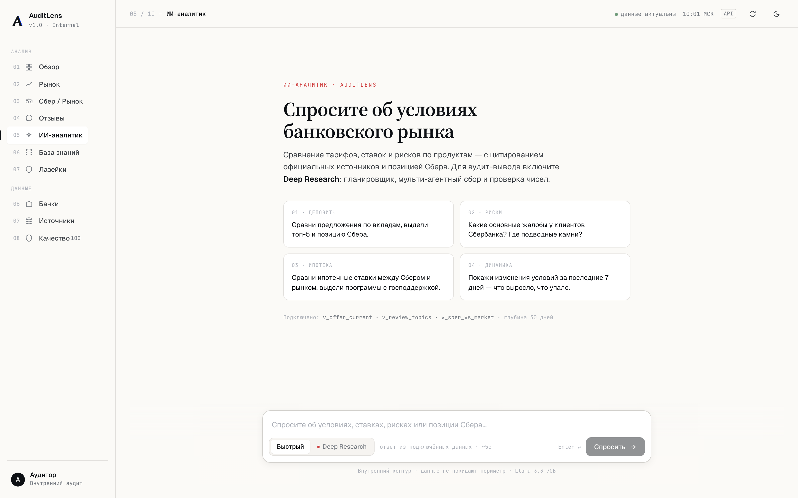
*Чат с Deep Research: живой прогресс по стадиям, ход мысли модели, план отчёта, источники с trust-индикаторами.*

### 02–04 · Аналитические вкладки

<table>
<tr>
<td width="50%">

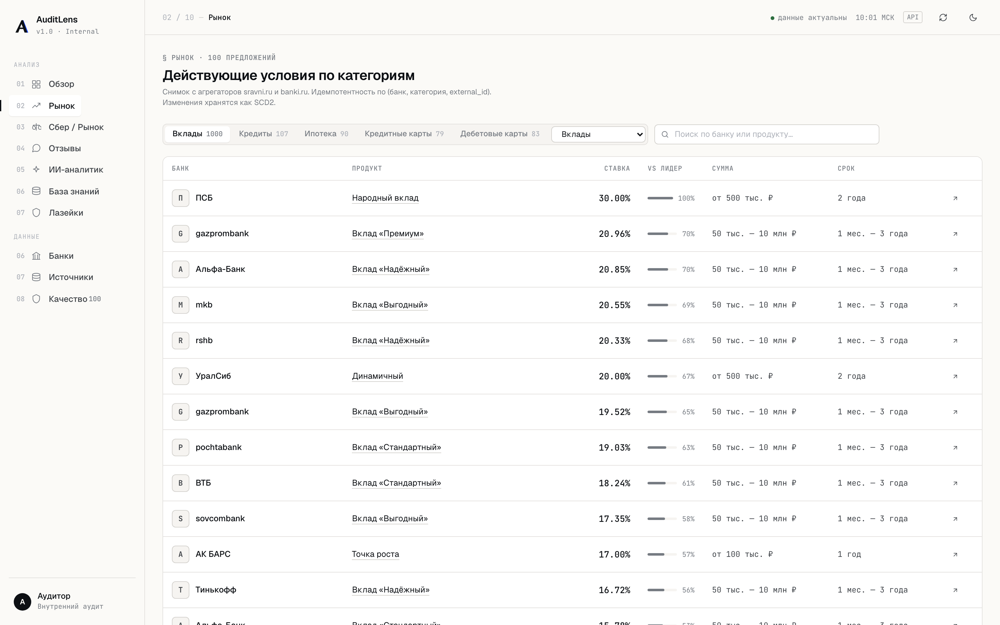
*Рынок: офферы из `v_offer_current` с фильтрами по категории, «vs лидер».*

</td>
<td width="50%">

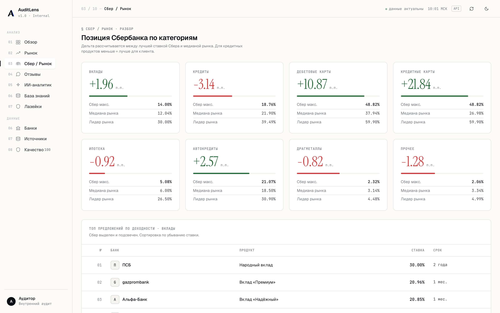
*Позиция Сбера против медианы рынка по категориям.*

</td>
</tr>
<tr>
<td width="50%">

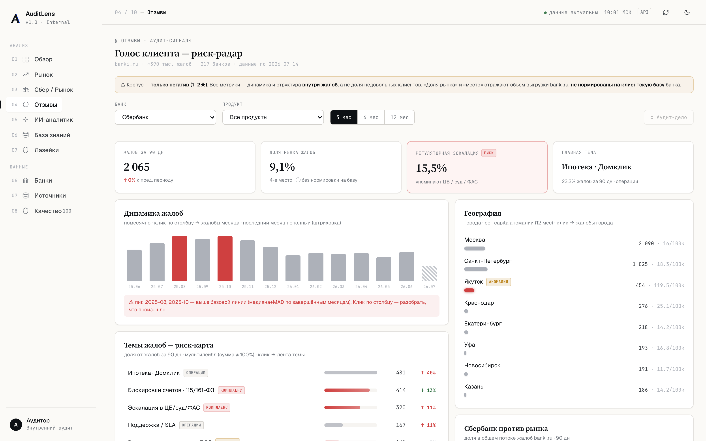
*Риск-радар: темы с классами риска, спайк-детект, гео-аномалии.*

</td>
<td width="50%">

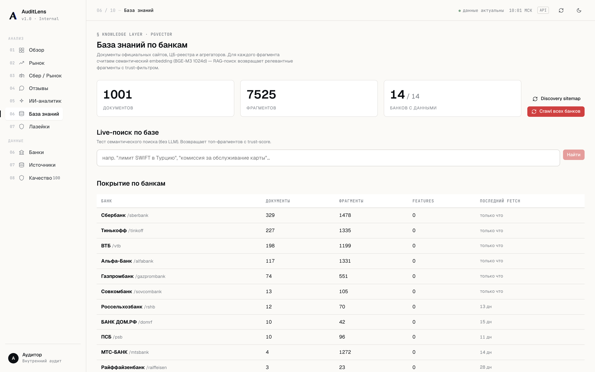
*База знаний: покрытие по банкам, live-поиск по pgvector (BGE-M3 1024d).*

</td>
</tr>
</table>

### 07 · Лазейки

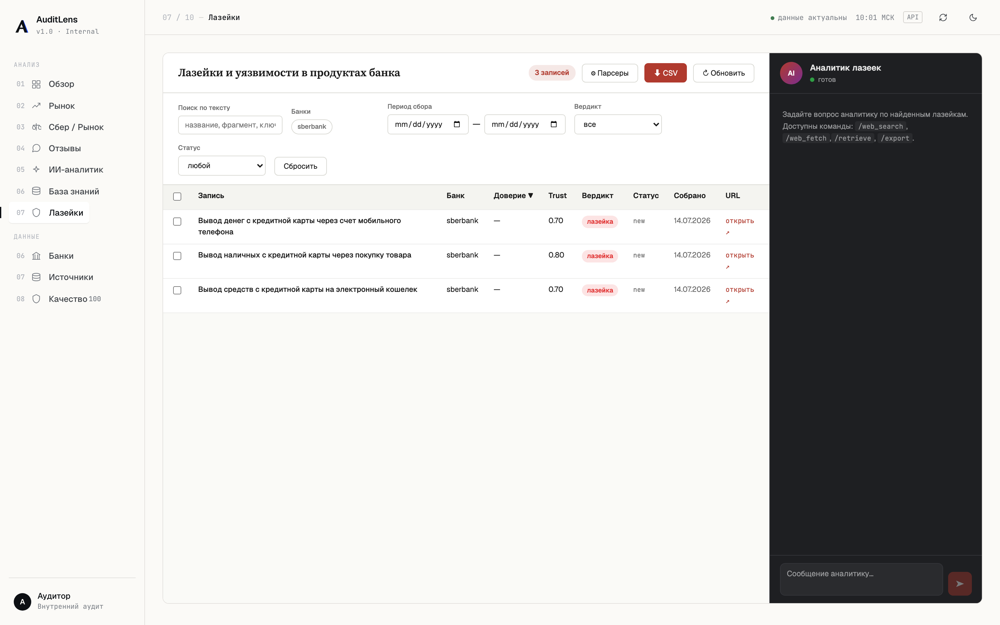
*Агент ищет схемы обхода комиссий и лимитов; найденное с вердиктом и trust-score попадает в таблицу.*

### 08–10 · Данные

<table>
<tr>
<td width="33%">

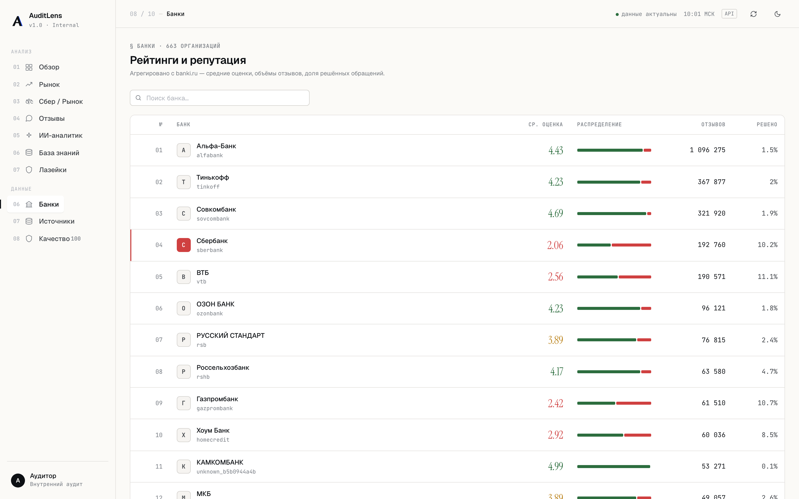
*Банки.*

</td>
<td width="33%">

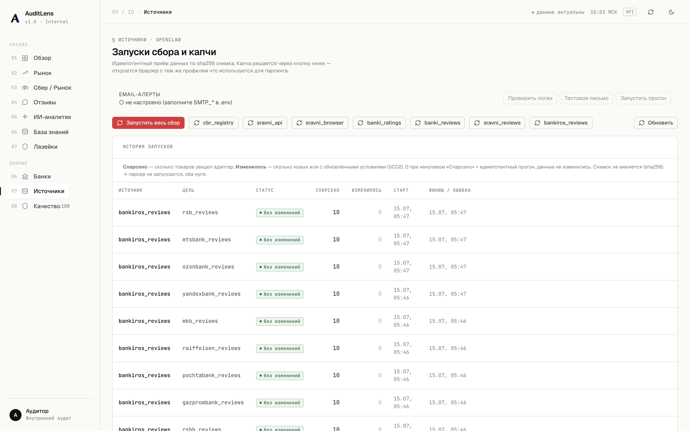
*Источники с trust-индикаторами.*

</td>
<td width="33%">

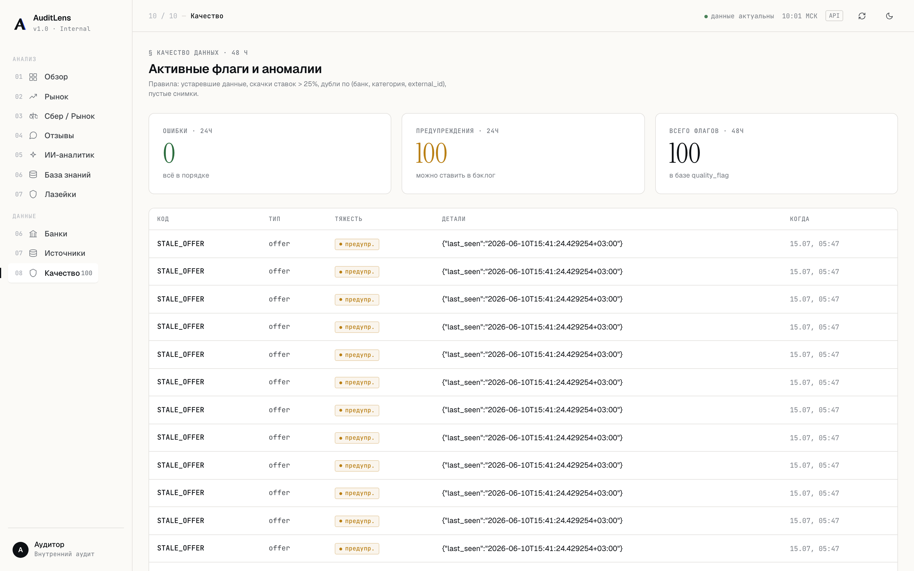
*Флаги качества данных.*

</td>
</tr>
</table>

---

## 🏗 Архитектура

<p align="center">
  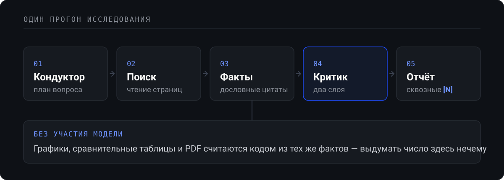
</p>

| Шаг | Что делает | Модуль |
|---|---|---|
| **01 · Кондуктор** | Разбирает вопрос: интент, субъекты, что считать раскрытым | `research/v2/conductor.py` |
| **02 · Поиск** | Подзапросы → метапоиск → чтение страницы: кэш, затем HTTP, затем браузер. Отличает «не смогли прочитать» от «банк не раскрывает» | `research/gptr/{planner,retriever,scraper}.py` |
| **03 · Факты** | Типизированные факты с дословной цитатой и стороной свидетельства: заявлено организацией, наблюдается в жалобах, установлено регулятором | `research/gptr/facts.py` |
| **04 · Критик** | Дешёвый слой подтверждает дословное совпадение и снимать не вправе; остаток судит модель | `research/gptr/critic.py` |
| **05 · Отчёт** | Сквозные `[N]`, ведущие на цитату; графики и таблицы считаются отдельно, кодом | `research/gptr/{citations,stream}.py` |

Поисковое ядро — движок [gpt-researcher](https://github.com/assafelovic/gpt-researcher) с нашими адаптерами: свой метапоиск, свой скрапер с эскалацией до браузера, свой планировщик подзапросов. Слой фактов, критик и цитирование — наши.

> Полное описание — [docs/ARCHITECTURE.md](docs/ARCHITECTURE.md): тиры моделей, бюджеты времени, анти-галлюцинации, специфика Cloud.ru.

**Стек:**

- **Python 3.11+**, FastAPI, SQLAlchemy 2, asyncio, SSE
- **PostgreSQL 17 + pgvector** — гибридный поиск: вектор (1024d, BGE-M3, HNSW) и русский полнотекст, слияние по RRF. Порога по косинусу нет намеренно: в этом проекте абсолютный порог по векторному сходству трижды оказался неработоспособен — честный сигнал даёт словесная нога
- **React 18 без бандлера** — Babel-standalone компилирует JSX в браузере, ни npm, ни webpack
- **Playwright Chromium** — скрейп за антиботами и PDF-экспорт
- **LLM** — любой OpenAI-совместимый эндпоинт. В проде — **Foundation Models Cloud.ru**; пять тиров моделей (fast / smart / reasoning / analyst / insight) с деградационной цепочкой
- **Web search** — SearXNG. Набор движков подбирался замером: `bing` пришлось отключить — он деградировал до случайного шума на банковских запросах, `dogpile` держит 88% годных результатов

**Модели (прод):**

| Тир | Модель | Где |
|---|---|---|
| fast / smart | `deepseek-ai/DeepSeek-V4-Flash` | навигация по выдаче, извлечение фактов, критик |
| reasoning / analyst | `anthropic/claude-opus-4.8` | план вопроса, нарратив отчёта |
| insight | `anthropic/claude-sonnet-4.6` | «Обзор», «Отзывы» (3 вызова в сутки) |
| фолбэк | `deepseek-ai/DeepSeek-V4-Pro` | когда основной тир недоступен |

Рассуждение (`reasoning_effort`) на горячем пути выключено намеренно: на планировании оно стоило 315 с против 24 с, на извлечении фактов — 204 с против 50 с, а качество плана не менялось.

---

## 📦 Структура репозитория

```
auditlens/
├── README.md                        ← ты здесь
├── LICENSE                          ← MIT
├── assets/readme/                   ← иллюстрации этого файла (SVG)
├── pyproject.toml                   ← зависимости
├── .env.example / .env.prod.example ← шаблоны конфига
├── docker-compose.yml               ← Postgres + SearXNG
├── Dockerfile                       ← прод-образ (+ Playwright)
├── docs/
│   ├── SETUP.md                     ← детальная установка
│   ├── ONBOARDING.md                ← онбординг разработчика
│   ├── API_KEYS.md                  ← где брать ключи
│   ├── USAGE.md                     ← примеры вопросов
│   ├── ARCHITECTURE.md              ← как устроена система
│   ├── DEPLOY_UVA.md                ← развёртывание в облаке
│   ├── TROUBLESHOOTING.md           ← типовые проблемы
│   └── img/                         ← скриншоты для README
├── migrations/                      ← SQL миграции (001–062 + ensure_vector)
├── config/
│   ├── sources.yaml                 ← реестр источников (10 источников)
│   └── ca_bundle_combined.pem       ← certifi + Russian Trusted Root
└── src/bank_audit/
    ├── ai/                          ← LLM-утилиты, тиры моделей, clarify
    ├── research/gptr/               ← движок: поиск, факты, критик, цитаты
    ├── research/v2/                 ← кондуктор и оценка доверия к источникам
    ├── rag/                         ← embedder, retriever, отзывы, trust
    ├── digest/                      ← «Обзор» — ежедневный брифинг
    ├── loophole/                    ← «Лазейки» — nanobot-агент
    ├── sources/ collectors/         ← адаптеры источников, Playwright
    ├── normalizer/ quality/         ← нормализация (SCD2), контроль качества
    └── web/                         ← FastAPI + React UI + PDF export
```

---

## 🛣 Roadmap

- [x] Deep Research — кондуктор, движок поиска, слой фактов с дословными цитатами
- [x] Критик из двух слоёв: дешёвая проверка подтверждает, модель судит остаток
- [x] Universal product support (любой банковский продукт без хардкода)
- [x] PDF export с графиками
- [x] «Обзор» — ежедневный брифинг с детерминированным пульсом
- [x] «Лазейки» — агент поиска схем обхода
- [x] Гибридный поиск (вектор + русский полнотекст) во всех вкладках
- [x] Проверка доступности ссылок и дата публикации источника
- [x] Развёртывание в облаке + Foundation Models
- [ ] Загрузка собственных PDF из UI
- [ ] Excel-экспорт сравнительных таблиц
- [ ] Snapshot-based diff («что изменилось в условиях по вкладам за месяц»)
- [ ] Telegram/Slack бот-интерфейс

---

## 🤝 Контрибьюции

PR'ы welcome. Перед отправкой:

1. `pip install -e ".[dev]"` — поставит pytest + ruff
2. `ruff check src/` — линтер
3. `pytest tests/` — тесты (если есть для твоей области)
4. Опиши **зачем** изменение, не только **что** сделано

---

## 📜 Лицензия

[MIT](LICENSE) — свободное использование с указанием авторства.

## 🙏 Acknowledgments

- [gpt-researcher](https://github.com/assafelovic/gpt-researcher) — каркас движка исследования
- [pgvector](https://github.com/pgvector/pgvector) — векторный поиск в Postgres
- [SearXNG](https://github.com/searxng/searxng) — open-source мета-поисковик
- [BGE-M3](https://huggingface.co/BAAI/bge-m3) — multilingual embeddings
- [nanobot-ai](https://pypi.org/project/nanobot-ai/) — harness агента «Лазеек»
- [Chart.js](https://www.chartjs.org/) — графики в UI и PDF

---

<div align="center">
Сделано для аудиторов, которые хотят тратить время на анализ, а не на сбор данных.
</div>
