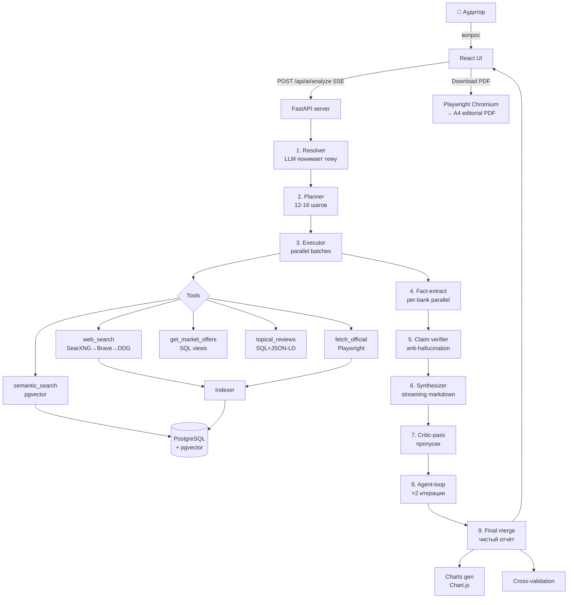

# Архитектура AuditLens

Один pipeline, две точки входа (UI и CLI), четыре слоя данных, девять LLM-проходов на Deep Research.

---

## Высокоуровневая схема



---

## Слои данных

| Слой | Технология | Что хранит | TTL |
|---|---|---|---|
| **Raw** | файлы `workspace/raw/` | сырые HTML/PDF/JSON ответы (sha256-индексированы) | бессрочно |
| **Document** | `document` таблица | мета о каждом документе: URL, trust_score, fetched_at | пока валиден |
| **Chunks** | `document_chunk` + pgvector | разбитые на ~512-токенов чанки + BGE-M3 embeddings (1024d) | пока валиден |
| **Структурированный** | `product_offer`, `review`, `bank` | нормализованные офферы/отзывы (SCD2 для изменений тарифов) | бессрочно |
| **Витрины** | `v_offer_current`, `v_sber_vs_market` | материализованные views для быстрых SQL-запросов | refresh по cron |

---

## Pipeline — Deep Research детально

### Stage 0: Resolver

`src/bank_audit/ai/query_resolver.py` — один LLM-вызов превращает свободный вопрос в structured JSON:

```json
{
  "topic": "семейная ипотека",
  "topic_synonyms": ["ипотека", "ипотечн", "семейн", "детьми"],
  "url_keywords": ["mortgage", "ipoteka"],
  "banks": [{"slug": "sberbank", "name": "Сбербанк", "domain": "sberbank.ru"}, ...],
  "category_hint": "mortgage",
  "wants_reviews": true,
  "wants_market_offers": true,
  "audience_filter": "семьи с детьми",
  "product_url_paths": ["/personal/credits/home/", "/mortgage/", ...],
  "bank_specific_paths": {"sberbank": ["domclick.ru/ipoteka/programmy"]},
  "is_socially_regulated": true
}
```

Ключевые поля:
- `is_socially_regulated=true` → автоматически добавятся govt-шаги (cbr.ru / pravo.gov.ru / mil.ru / gosuslugi.ru)
- `product_url_paths` → fallback URL'ы когда поисковики банят
- `topic_synonyms` → морфологические формы для ILIKE-поиска в БД

### Stage 1: Planner

`PLANNER_SYSTEM` инструктирует LLM выдать 8-16 atomic шагов. Каждый шаг = `{n, title, tool, query, entity}`.

После planner'а — программная инжекция:
- `get_market_offers` если `wants_market_offers=true`
- `get_review_themes` для каждого банка с отзывами
- 2 govt-шага если `is_socially_regulated=true`

### Stage 2: Executor

Шаги выполняются **батчами по 4 параллельно**. Каждый tool:
- кэшируется по hash(query + tool + params) TTL=1ч
- автоматически делает `web_search` fallback если semantic возвращает 0 результатов
- результаты дедуплицируются по URL

### Stage 3: Fact-extract (per-bank parallel)

`asyncio.gather(*[_extract_for_bank(slug) for slug in plan_bank_slugs[:6]])`

На каждый банк отдельный LLM-вызов с 30 chunks×1200 chars контекста. Результат — маркированный список фактов с цитатами `[N]`.

### Stage 4: Claim-verify

`_verify_fact_line()` — regex-нормализует числа в каждой строке, проверяет что они РЕАЛЬНО есть в excerpts цитированных источников. Не прошедшие — отбрасываются. На карте ветерана СВО дроп был 19/30 (63%) — это норма, защита от галлюцинаций.

### Stage 5-9: Synth → Critic → Agent → Merge

Streaming LLM-вызовы. Если ответ короткий или recall <50% — запускается critic-pass (добавляет missing facts). Agent-loop делает до 2 итераций targeted web-search'ей под обнаруженные пробелы. Final merge консолидирует draft + addendum'ы в один чистый markdown.

---

## Web search backends (приоритет)

```
SearXNG (self-hosted)  →  Brave Search API  →  DuckDuckGo  →  Yandex Search
       ↓ если упал             ↓                  ↓               ↓
    fallback                fallback           fallback        last resort
```

Каждый backend проверяется параллельно с timeout 8s. Дедуп по URL.

---

## Anti-hallucination — 3 уровня защиты

1. **Topical filter** — `_matches_topic()` исключает off-topic документы перед synth'ом
2. **Claim-verify** — каждая строка с числом проверяется regex'ом против excerpts источника
3. **Invalid citation filter** — `_filter_invalid_citations()` удаляет `[N]` где N не существует

---

## Trust scoring

```python
trust_score = base_weight + adjustments
```

| Класс | Домены | Weight |
|---|---|---|
| **regulator** | cbr.ru, pravo.gov.ru, government.ru, mil.ru, ... | 0.92-0.98 |
| **government** | gosuslugi.ru, fns.gov.ru, rosreestr.ru, ... | 0.85-0.90 |
| **legal_db** | consultant.ru, garant.ru, kodeks.ru | 0.82-0.85 |
| **bank_official** | sberbank.ru, vtb.ru, alfabank.ru, ... | 0.95 |
| **aggregator** | banki.ru, sravni.ru | 0.65 |
| **blog** | (auto-add unknown domains) | 0.30 (cap 0.10 после adjustments) |

Adjustments: sponsored/captcha → 0.0 (исключается из RAG).

---

## Кэширование

- **rag_cache** (in-memory + БД-backed) — tool results, TTL=1ч
- **embedder cache** — 64KB в RAM, повторные embed одного текста бесплатно
- **prompt cache** Anthropic/OpenAI — используется автоматически SDK

---

## Файловая структура кода

```
src/bank_audit/
├── ai/
│   ├── analyst.py            ← legacy быстрый chat-режим
│   ├── deep_research.py      ← главный pipeline (~3500 строк)
│   ├── query_resolver.py     ← Stage 0 resolver
│   └── outline_planner.py    ← структура отчёта
├── rag/
│   ├── embedder.py           ← BGE-M3 singleton
│   ├── chunker.py            ← markdown-aware chunking
│   ├── indexer.py            ← URL → document_chunk
│   ├── retriever.py          ← pgvector search
│   ├── fetcher.py            ← httpx + Russian CA bundle
│   ├── web_search.py         ← SearXNG/Brave/DDG/Yandex
│   ├── trust.py              ← scoring + KNOWN_BANK_DOMAINS + GOVT_TRUST_DOMAINS
│   ├── cache.py              ← memcache-style helper
│   └── parsers/              ← HTML/PDF/JSON-LD parsers
├── collectors/               ← Playwright browser collectors
├── normalizer/               ← review→theme классификация
├── orchestrator/             ← OpenClaw cron jobs
├── analytics/                ← SQL views
└── web/
    ├── app.py                ← FastAPI server (~700 строк)
    ├── pdf_export.py         ← Playwright→A4 PDF
    └── static/
        ├── index.html        ← inline CSS (premium design tokens)
        └── app.jsx           ← React via Babel-standalone (1812 строк)
```

---

## Расширение под новый банк

1. Добавить домен в `KNOWN_BANK_DOMAINS` (`rag/trust.py`)
2. (опционально) добавить bank-specific URL templates в `BANK_PRODUCT_URL_TEMPLATES` (`rag/web_search.py`)
3. INSERT в таблицу `bank`
4. (опционально) первичный seed: `python -m bank_audit.cli ingest-url <bank-product-page>`

Дальше resolver сам подхватит банк через `_load_db_context()`.

## Расширение под новый продукт

Ничего хардкодить не нужно — `is_socially_regulated` и `product_url_paths` генерирует resolver-LLM на основе вопроса. На любом банковском продукте система работает out-of-the-box.
