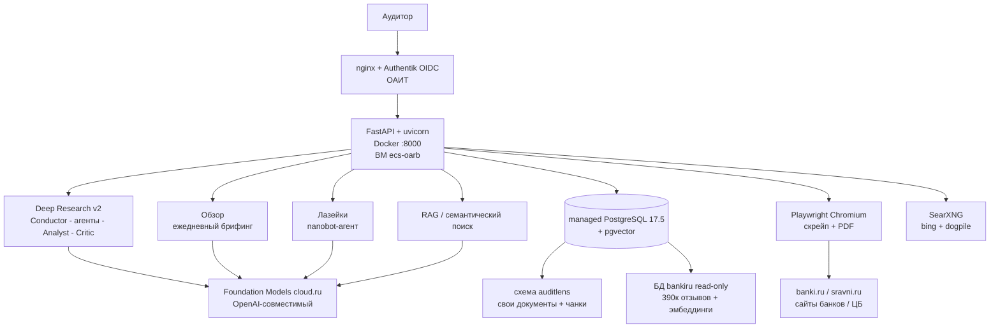
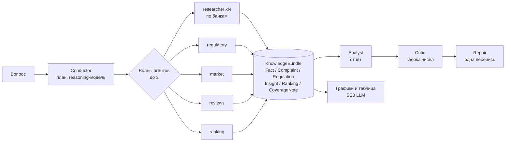

# Архитектура AuditLens

> Документ описывает систему **как она реально развёрнута** в Облаке УВА (Cloud.ru) по состоянию на 15.07.2026.
> Числа, имена функций и значения env сверены с кодом и с прод-инстансом `ecs-oarb`.
> Где документированное расходится с фактическим — это явно отмечено.

---

## 1. Что это

**AuditLens** — платформа внутреннего аудита розничных банковских продуктов. Аудитор задаёт вопрос на естественном языке («сравни ипотеку Сбера с рынком», «что не так с начислением процентов по кредиткам») и получает **обоснованный отчёт со ссылками на источники**, а не правдоподобный текст от языковой модели.

Ключевое отличие от «LLM + поиск»: **числа считает детерминированный код, LLM только формулирует**. Всё, что модель могла бы выдумать, либо сверяется с фактами регуляркой, либо вообще не доверяется модели — графики и сравнительные таблицы строятся из `bundle.facts`, минуя LLM.

Контур: **К4**, боевых данных нет. Доступ режет **Authentik (OIDC)** на nginx-прокси ОАИТ.

---

## 2. Карта системы



---

## 3. Развёртывание в Облаке УВА (Cloud.ru)

Самая содержательная часть: почти все нетривиальные решения продиктованы **ограничениями корпоративного облака**, а не academic-инженерией.

### 3.1 Периметр

| Компонент | Как есть |
|---|---|
| ВМ | `ecs-oarb`, Ubuntu 24.04, 4vCPU/8GB, регион ru-moscow-1 (движок Huawei) |
| Приложение | один контейнер `auditlens-app`, `--network host`, порт `:8000` |
| Доступ | nginx ОАИТ + **Authentik (OIDC)** → приложение **не содержит своей авторизации и TLS** |
| БД | **managed PostgreSQL 17.5** + pgvector, схема `auditlens` |
| LLM + эмбеддинги | **Foundation Models cloud.ru**, `https://foundation-models.api.cloud.ru/v1/` (OpenAI-совместимый) |
| Снаружи | порт закрыт security-группой; разработчик ходит SSH-туннелем |

Запуск (durable-паттерн):

```bash
docker run -d --name auditlens-app \
  --network host --init --restart unless-stopped \
  --env-file ~/auditlens/.env \
  -v $WS:$WS \
  auditlens:prod        # entrypoint: serve
```

### 3.2 Четыре решения, продиктованные облаком

**① «Vector-free» фаза миграций.**
Роль приложения в managed-PG — **не суперюзер**, `CREATE EXTENSION vector` выполняет только ОАИТ и, возможно, позже первого наката. Блокироваться на этом нельзя. Решение — расщепление миграции:

- `CREATE EXTENSION` в `005_rag_foundation.sql` обёрнут в `DO $$ … EXCEPTION WHEN insufficient_privilege THEN RAISE NOTICE` — миграция не падает;
- вектор-колонка `document_chunk.embedding vector(1024)` и HNSW-индекс вынесены в **`migrations/ensure_vector.sql`**, который применяется на **каждый** `migrate` и **не журналируется** в `schema_migrations` — то есть до-создаёт вектор-объекты в тот момент, когда расширение наконец появится.

**② Экономия ~2.5 ГБ образа — архитектурой, а не упаковкой.**
`torch` / `sentence-transformers` не «вырезаны», а вынесены в optional-extra `local-embeddings`. Их отсутствие компенсировано тем, что **bge-m3 уже доступен как сервис** в Foundation Models → в проде `EMBEDDING_MODE=api`, и torch вообще не импортируется.

**③ `--init` (tini) — обязательный флаг, а не косметика.**
`entrypoint.sh` делает `exec uvicorn` → uvicorn становится PID 1 (нужно для корректного SIGTERM). Но PID 1 обязан реапить осиротевшие процессы, а Playwright порождает Chromium **на каждый** скрейп и PDF-экспорт. Без tini зомби копятся и переполняют память.

**④ Эмпирика вместо документации: поиск сузили по факту замеров.**
С IP дата-центра cloud.ru из ~8 движков SearXNG выживают ровно **два — bing и dogpile** (~18 результатов/запрос). Google, Yandex, Brave, DDG, Qwant, Mojeek, Startpage отдают капчу. Конфиг не «на всякий случай широкий», а `keep_only: [bing, dogpile]`.

### 3.3 Прочие детали периметра

- `/healthz` и `/readyz` зарегистрированы строго **до** catch-all `/{full_path:path}` SPA-фоллбэка — иначе фоллбэк вернул бы 200+HTML на health-пробу, и оркестратор считал бы мёртвое приложение живым.
- Доверие к CA Минцифры разное по клиентам: httpx получает бандл явно (`verify=CA_BUNDLE_PATH`), Chromium — грубым `--ignore-certificate-errors`.
- Идентичный bind-mount `-v $WS:$WS` (одинаковый путь внутри и снаружи) — вынужденно: `WORKSPACE_DIR` в `.env` содержит хостовый путь.

### 3.4 Честный разрыв: документированное ≠ фактическое

- `docs/DEPLOY_UVA.md` описывает `compose` + `run --rm app migrate` + журнал `schema_migrations`.
- **Реальность:** `docker run --network host`, а миграции накатываются **руками** через `docker cp` + `psql` — журнала на проде нет.
- ⚠️ Полгода рядом с боевым контейнером `:8000` жил **осиротевший bare-metal uvicorn `:8011`** со старым кодом — правки туда были невидимы пользователям. Классический сюжет «почему деплой не виден».

---

## 4. Модели: пять тиров и рубильник комплаенса

### 4.1 Архитектура тиринга

Централизованного конфига моделей **нет**: `Settings` (`config.py`) не содержит ни одного LLM-поля, модели резолвятся через `os.getenv` в точках вызова. Де-факто реестр — `ai/analyst.py`.

Тиров **пять**: `FAST` / `SMART` / `INSIGHT` (есть геттеры) + `REASONING` / `ANALYST` (читаются напрямую в `research/*`).

Главное решение — **деградационная цепочка**: `явный аргумент → спец-env → SMART/FAST → LLM_MODEL_NAME → хардкод`. Докстринг `_tier_models()` прямо говорит: при отсутствии `LLM_MODEL_FAST` падаем на smart — **тиринг безопасно выключается**. Любой тир можно не задавать, и система схлопнется в одну модель без правки кода.

### 4.2 Что реально стоит на проде

```
LLM_BASE_URL   = https://foundation-models.api.cloud.ru/v1/
LLM_MODEL_NAME = openai/gpt-oss-120b        # базовый фолбэк (внутренняя модель контура)
```

| Тир | Модель на проде | Где применяется | Почему именно так |
|---|---|---|---|
| **FAST** | `google/gemini-2.5-flash` | навигация агентов (поиск/чтение/роутинг), planner, resolver, charts | итераций много, решение «какой tool позвать» дешёвое — платить за reasoning незачем |
| **SMART** | `google/gemini-2.5-flash` | глубокое чтение источников, **финальное извлечение фактов**, критик, merge | точность чисел и цитат критична; сверху есть Critic |
| **REASONING** | `google/gemini-3.1-pro-preview` | Conductor (план), нарратив, верификация, clarify | ~10 вызовов на прогон, но именно они определяют качество плана и связность отчёта |
| **ANALYST** | `google/gemini-3.1-pro-preview` | Analyst — сборка отчёта | длинный связный текст с опорой на факты |
| **INSIGHT** | `anthropic/claude-sonnet-4.6` | «Обзор» (headline/news/reviews_brief), «Отзывы» | **3 вызова в сутки на всех ~50 пользователей** — дорогую модель можно себе позволить |
| — | `openai/gpt-4.1` | **мозг агента «Лазейки»** (`LOOPHOLE_NANOBOT_MODEL`) | вынужденно, см. 4.4 |

Эмбеддинги: **`BAAI/bge-m3`, 1024d, 512 токенов**, `EMBEDDING_MODE=api` через те же Foundation Models.

### 4.3 Рубильник «внутренний контур ↔ внешние модели»

В `.env.prod.example` прямым текстом: **«Внутренние модели (комплаентный дефолт). Внешние (gemini/claude/gpt) — по согласованию»** — и все пять тиров там выставлены в `openai/gpt-oss-120b`.

То есть архитектура спроектирована как **рубильник**: по умолчанию всё крутится на внутренней модели контура, а качество поднимается сменой пяти строк env — после согласования с ОАИТ. На текущем проде рубильник переведён на внешние модели (таблица выше). **Смена модели = env + рестарт, без правки кода** (константы вычисляются на импорте).

### 4.4 Почему у «Лазеек» отдельная модель

Агент «Лазеек» построен на **nanobot-ai**, который строит tool-схемы в OpenAI-формате (list-типы, `default`, `items`). Gemini валидирует `function_declarations` строго и отвечает `400 INVALID_ARGUMENT: Proto field is not repeating` на стадии ответа — агент молча выдавал пустоту.

Поэтому `LOOPHOLE_NANOBOT_MODEL=openai/gpt-4.1` задан **только в прод-`.env`** (в репозитории его нет). Диагностировано эмпирически: с gpt-4.1 агент реально ходит по инструментам и даёт обоснованный ответ с источниками.

> **Урок для доклада:** OpenAI-совместимый эндпоинт ≠ OpenAI-совместимое поведение. Совместимость chat-completions не означает совместимости function-calling.

### 4.5 `reasoning_effort`: дёшево по умолчанию, дорого точечно

`_patch_client_reasoning_effort()` (`ai/llm_utils.py`) — **monkey-patch клиента**: подменяет `chat.completions.create` и подмешивает `extra_body={"reasoning_effort": …}` (прод: `low`). Патч не перетирает уже проставленный effort — на этом строится `deep_reasoning_extra()` (прод: `medium`), который точечно поднимает effort в **10 местах**: план, нарратив, критик, grounding, clarify.

Мотивация в докстринге: глобальный `low` — потому что частые nav-итерации агентов «жгут время», но немногочисленные reasoning-вызовы «от этого становятся плоскими».

Тот же патч чинит несовместимость: если в имени модели есть `gpt-5`, а `temperature ≠ 1` — параметр молча удаляется (GPT-5 поддерживает только дефолтную температуру, а пайплайн ставит `0.0` для детерминизма).

### 4.6 Тиринг внутри одного агента

`base_agent.py` объявляет **два** атрибута класса:

- `MODEL_TIER` — модель для **итераций** цикла (поиск/чтение/роутинг);
- `FINAL_MODEL_TIER` — модель для **финального извлечения** структуры.

У `researcher`: `loop=fast`, `final=smart` — «навигация быстрая, извлечение фактов сильное (точность чисел критична, плюс Critic перепроверяет)». У механических агентов (`regulatory`, `market`, `reviews`) — `fast`, у `ranking` — `smart`.

Выбор тира **протёк даже в лимит обрезки tool-результатов**: `read_url` → 18000 символов, поиск → 12000, с обоснованием «финальное извлечение идёт из истории сообщений, и потерянный кусок страницы = потерянный факт».

### 4.7 Толерантный JSON-парсер как плата за reasoning-модели

`_loose_json_loads()` — **8 последовательных стратегий** разбора: скан balanced top-level `{...}` с учётом строк/escape, срез markdown-fence, вычистка control-символов, снятие trailing comma, обрезка по последней сбалансированной скобке, починка чисел внутри `"data":[…]` (убирает `+`, пробелы, единицы «%/руб/млн», меняет запятую на точку), поэлементный разбор массива.

Причина в докстринге: «reasoning-leak, fences, trailing comma, числа» — прямое следствие ставки на reasoning-модели, которые подмешивают размышления в ответ.

---

## 5. Deep Research v2 — ядро

Точка входа — `stream_deep_research_v2()` (`research/v2/orchestrator.py`), асинхронный генератор SSE. Переключатель `DEEP_V2=1`.

Это **не «LLM с поиском», а многоагентный пайплайн**: режиссёр → автономные исполнители → аналитик → критик.



Агенты пишут находки **не в чат**, а в типизированный контейнер `Fact` / `Complaint` / `Regulation` / `Insight` / `Ranking` / `CoverageNote`. Bundle append-only — любой срез по времени не теряет собранное.

### 5.1 Conductor (планировщик)

`plan_research()` — главный reasoning-вызов: `temperature=0.0`, `max_tokens=8000`, effort поднят. Возвращает `ResearchPlan`: intent, `question_nature`, subjects, missions, dependencies, output_sections. В промпт вшито правило точки зрения: **Сбер — всегда якорный субъект, конкуренты — бенчмарк**. Агентов минимум 2, максимум 5.

Три детерминированные пост-обработки плана:

- **`_salvage_truncated_json()`** — обрезанный по `max_tokens` план досбалансируется по скобкам, отбрасывая последнюю неполную запись: «план с N миссий лучше, чем fallback». (3000 токенов рвало план на 5 банках.)
- **`fan_out_researcher()`** — одна миссия по всем банкам разворачивается в N миссий по одному субъекту. `agent_id` остаётся `researcher`, чтобы не сломать зависимость `ranking ← researcher`.
- **`attach_banki_sources()`** — детект до 3 категорий продукта и подшивка до 8 детерминированных URL `banki.ru/products/{cat}/{slug}/` (со словарём override: `tinkoff→tbank`, `rosselkhozbank→rshb`).

При падении LLM — `_fallback_plan()`: researcher + reviews по `detect_bank_slugs()`.

### 5.2 Волны агентов

До 3 волн. В волне `ready` = миссии, чьи зависимости выполнены; если готовых нет — берутся все (не блокируем). Запуск через `asyncio.ensure_future` + `asyncio.wait`: **`step_done` летит по мере готовности каждого агента** (as_completed), а не после всей волны.

Зависимым агентам подмешивается **полный** `bundle.to_prompt_context(max_chars=16000)`, а не выжимка — иначе `ranking` ранжировал вслепую и переискивал найденное.

### 5.3 Agent-loop: три приёма, которые стоит показать

**① «Не уговаривай модель — забери инструмент».**
Промпт «сделай 1–2 поиска» агент игнорирует. Работает только **физическое удаление** `web_search` из `tools_schema` после исчерпания капа + пинок в историю «БОЛЬШЕ НЕ ИЩИ».
Капы: `search_cap = max(3, V2_WEB_SEARCH_PER_SUBJECT × n_subj)`; `read_cap` считается по **успешным** чтениям + отдельный потолок попыток (`read_cap*2+2`) — SPA/404/captcha отдают пустоту и раньше жгли слоты.

**② Анти-«паралич поиска».**
Если ≥2 поиска и 0 чтений — принудительное `tool_choice={"type":"function","function":{"name":"read_url"}}` (жёсткая dict-форма) + список накопленных URL. Срабатывает один раз; при 400 — fallback на `"auto"`.

**③ Грейсфул-финал.**
При исключении LLM-вызова, если `n_tool_calls > 0`, всё равно вызывается `_extract_final()` — иначе `break` минует финал-ветку и **прочитанные страницы теряются**.

Плюс: параллельные tool-calls через `asyncio.gather` (раньше `read_url` на 3–6 URL шли по одному); `_salvage_json()` для обрезанного финала; `_is_model_unavailable()` — ловит «холодный» 400 (invalid model ID) от cloud.ru и деградирует на `smart_model`.

### 5.4 Экономика времени (боль, вокруг которой построено всё)

Прогоны **зависали на 40 минут**. Сейчас — трёхуровневый бюджет:

| Уровень | Дефолт в коде | На проде | Смысл |
|---|---|---|---|
| Вся research-фаза | `V2_TOTAL_BUDGET_S=420` | 420 | общий потолок |
| Один агент | `V2_AGENT_BUDGET_S=220` | **170** | мягкий финал из собранного |
| Один LLM-вызов | стена 60 / 75 / **180** с | — | дифференцирована **по весу вызова** |

Про стену отдельно: `httpx` read-timeout поштучный **на чанк** и НЕ ловит медленный стрим — вызов ползёт минутами. Поэтому в `llm_throttle.py` две wall-clock стены: `_WALL_LOOP_S=60` для навигационных вызовов («короткие по природе — решение какой tool позвать») и `_WALL_HEAVY_S=180` для тяжёлых (`max_tokens ≥ 6000`). История правки зафиксирована в коде: 120→180, потому что «reasoning_effort=high + больший контекст стримятся дольше; на 120 с аналитик срывался в детерминированный фоллбэк».

Плюс семафор `LLM_MAX_CONCURRENT=8` и экспоненциальный backoff с jitter на 429.

Прод расширяет охват против дефолтов кода: `V2_READ_PER_SUBJECT=6` (код 4), `V2_READ_URL_CAP_MAX=18` (код 12), `V2_WEB_SEARCH_PER_SUBJECT=3` (код 2).

**Graceful partial с честностью:** при исчерпании бюджета система не отдаёт молча урезанный отчёт, а пишет в bundle `CoverageNote` с причиной («вероятно, медленные источники за антиботом/капчей») — и это доезжает до виджета «Пробелы покрытия».

### 5.5 Анти-галлюцинации

Защита эшелонирована. Ключевые слои:

1. **Запрет извлекать числа из SERP-сниппетов** — только из прочитанной страницы.
2. **Детерминированная сверка**: Critic регуляркой достаёт каждое число **с единицей** из отчёта и сверяет с числами из `bundle` — допуск 2%, годы 1990–2050 в whitelist.
3. **Вычистка невалидных `[N]`** — ссылка на несуществующий источник удаляется.
4. **Графики и сравнительная таблица считаются без LLM** из `bundle.facts` — числа физически не могут быть выдуманы.
5. **Детерминированный фоллбэк**: если reasoning-модель недоступна, отчёт собирается прямо из фактов — и это честно помечено в тексте.
6. **Курируемый список «требуют ручной проверки»**.

### 5.6 SSE-контракт

19 типов событий: `mode`, `phase`, `stage_status`, `plan`, `step_start`/`step_done`, `agent_tool_call` (живой статус: какой tool, `n_reads`), `reasoning` (дельты по стадиям), `sources`+`coverage`, `verification`+`claim_check`, `text`, `chart`, `ranking`, `insights`, `gaps`, `outline`, `done`.

Поверх генератора надет **`_with_heartbeat()`**: раз в 2 с в «тишине» до-эмитит последний `stage_status` с обновлённым таймером, **не отменяя `__anext__`** (отмена async-генератора в середине await рвала весь pipeline).

> **Стрим наоборот.** Прокси cloud.ru буферизует `content`, но **не буферизует `reasoning_content`**. Поэтому пользователю живьём показывают **ход мысли модели**, а сам ответ приходит пачкой — инверсия того, что все ожидают от стриминга LLM.

Финал — премиальный PDF через Chromium (`web/pdf_export.py`), с ожиданием `window.__chartsRendered === true` вместо таймаута.

---

## 6. RAG и слой данных

### 6.1 Два корпуса, один вектор-контур

| Корпус | Что | Режим |
|---|---|---|
| `auditlens` (своя схема) | всё, что агент скачал: `document` → `document_chunk` c `embedding vector(1024)` + HNSW | rw, **15 120 чанков** |
| `bankiru` (БД коллеги) | **~390 тыс.** негативных отзывов (1–2★, 217 банков) + **готовые эмбеддинги** bge-m3 1024d с HNSW | **read-only** |

**Ключевое решение — не пересчитывать чужие эмбеддинги.** `rag/bankiru_reviews.py` открывает второй engine с `default_transaction_read_only=on` и джойнит `e.embedding` как есть. Локальный BGE-M3 зовётся ровно **один раз за запрос** — посчитать вектор самого запроса.

Тонкость, ломающая наивную интеграцию: **bge-m3 асимметричен**. Документы посчитаны с passage-префиксом, поэтому запрос обязан эмбедиться с префиксом `"Represent this sentence for searching relevant passages: "` — иначе косинус деградирует.

Индекс: `CREATE INDEX chunk_embedding_hnsw ON document_chunk USING hnsw (embedding vector_cosine_ops) WITH (m = 16, ef_construction = 64)`.

Кэш эмбеддера — 5000 записей по `sha256(text)[:32]`; `cosine_similarity()` = простой dot product, т.к. векторы L2-нормализованы (в API-режиме нормализация делается вручную, провайдер её не гарантирует).

### 6.2 Слайд «HNSW не всегда быстрее»

Три контринтуитивных факта из одного файла:

- под **селективным фильтром** HNSW возвращал **0 результатов** → точный скан по MATERIALIZED-CTE оказался надёжнее;
- полный точный скан 41k векторов Сбера — **13 с**, что при мульти-поиске по 5 банкам вешало агента на ~26 с;
- лечение — кап кандидатов `BANKIRU_CAND_CAP=12000` + `statement_timeout`.

### 6.3 Дедупликация: «одна жалоба = один URL»

Краулер 08.07 залил ~**304 реальных отзыва сотнями тысяч копий** (до **4634×** на один URL). Аналитика показывала у Сбера **+829%** и ложные пики в радаре.

Лечение — семантическое правило на нашей стороне: `count(*)` → **`count(DISTINCT url)`** во всех агрегатах и **`DISTINCT ON (url)`** в выдаче и в кандидатах семантики. Побочно — оптимизация выдачи с 250 с до 11 с.

### 6.4 Риск-радар «Отзывы»

`rag/reviews_dash.py` (656 строк): KPI, помесячная динамика, **аудиторская таксономия из 21 темы / 145 regex-паттернов** в трёх классах риска (compliance / conduct / ops), Сбер-vs-рынок, гео-аномалии per-100k по словарю из 144 городов, лента доказательной базы.

**Robust-статистика:** спайки детектятся через **медиану + MAD** (`thr = med + 2·MAD`, плюс `n ≥ med·1.4`), а не mean+std — устойчиво к самому пику и к растущему тренду. Текущий неполный месяц явно исключён из baseline.

---

## 7. «Обзор» — ежедневный брифинг

Один прогон в сутки на всех ~50 пользователей, кэш в `daily_digest` (`010_daily_digest.sql`).

**Центральное решение: строка = (дата × секция)**, а не «дайджест одним JSON». Шесть секций (`headline`, `reviews_pulse`, `tariff_moves`, `quality_ops`, `news`, `reviews_brief`) генерятся, падают и перегенерируются независимо → **граница отказа — секция, а не страница**. У каждой свой статус: `ok` / `stale` / `degraded`.

Разделение труда жёсткое: **все числа считает детерминированный SQL (0 токенов), LLM только формулирует и ранжирует**.

**Ref-реестр как граница доверия к LLM.** В `headline` модель физически не может ошибиться в числе или подсунуть чужой URL: она возвращает только **`ref` из списка кандидатов**, а `_enrich()` достаёт данные из реестра и обогащает карточку `drill` / `ai_prompt` / `provenance` / `viz`.

**LLM-вызовов ровно 3 в сутки**, все через `insight_model()` (прод: `claude-sonnet-4.6`). В промпты вшит `today_anchor()` — якорь даты против knowledge cutoff. Экономика вынесена в UI: подвал доверия печатает «Nk токенов/день · один на всех», а `daily_digest` хранит `tokens_in/out/gen_ms/llm_model` по каждой секции.

Прочие находки:

- **`lazy_allowed()`** — временна́я связность двух джобов выражена в коде: lazy-генерация запрещена до 07:00, потому что визит в 00:30 сгенерил бы «утренний» выпуск **до** автосбора тарифов в 05:00.
- **Детектор `after_pause`** — система умеет заподозрить саму себя: если сбор не ходил 3+ дня, все диффы кластеризуются в момент прогона, и «≥3 банков за 48 ч» — артефакт сбора, а не движение рынка.
- **Статус `kept`** — ручная перегенерация, споткнувшаяся о транзиентную ошибку, не имеет права затереть уже лежащий хороший контент дня.
- **`conn.invalidate()` в `finally`** advisory-лока — иначе session-lock утёк бы обратно в пул и заблокировал генерацию дня до рестарта.
- **«Тишина как результат работы»**: пустые «Тарифные движения» рендерятся не как пустота, а как «Изменений не зафиксировано · под наблюдением N банков · последний сбор \<дата\>».
- **`bfPickHot`** — оранжевый акцент в передовице есть **всегда**, с 5-уровневым фолбэком: точное совпадение с `hot` от LLM → без учёта регистра → регулярка на число с единицей → бренд/регулятор → последние 2 слова → весь заголовок. Типографский приём не имеет права исчезнуть из-за того, что модель вернула `hot` в другом регистре.
- Оптимистичный `refreshing:true` на ручном ⟳: сервер мог не закоммитить `mark_run`, мгновенный GET вернул бы `false` и поллинг не стартовал бы; 409 «уже генерится» тоже трактуется как успех.

---

## 8. «Лазейки»

Модуль соседней команды (~6100 строк Python + 24 тест-файла), интегрирован через PR. Ищет **лазейки** — слабые места в продуктах и тарифах, которые клиенты и ИП используют, чтобы уйти от комиссии, обойти лимит или продлить грейс. Это **не хищение**, а эксплуатация несовершенства условий, несущая банку потери комиссионного/процентного дохода.

- Агент на **nanobot-ai**; инструменты: `audit_web_search`, `audit_web_fetch`, `audit_extract_loopholes`, `audit_db_query` (READ-ONLY SELECT), `audit_table_load`, `audit_save_loophole`, `audit_export`.
- **Все встроенные tools nanobot выключены** (`web`, `exec`, `file`, `cliApps`, `my`, `imageGeneration` = `enable: false`) — у LLM-агента нет ни exec, ни файлов. Для аудита осмысленная изоляция.
- Встроен во вкладку через **iframe** со своим React-рутом и своим `/api/loophole/*`-роутером; `Shell` монтирует его один раз и прячет через `display:none`, чтобы не терять состояние чата.
- В системный промпт вшита **доменная таксономия ~40 схем** (уход от комиссии ИП, обнал СберСпасибо, продление грейса через отмену покупок, рефинанс не по целевому назначению, дробление заявок…), обязательная методология расследования (2–4 поиска разными формулировками, ретрай перед «не найдено») и планка глубины ответа: механизм → где лазейка → кто эксплуатирует → потеря банка → серьёзность → доказательства+URL → рекомендации аудитору.
- **Маскировка ПД перед отправкой в LLM** (`pii_mask.py`): 8 типов (телефон РФ, карта, ИНН, СНИЛС, паспорт, email, ФИО, адрес) с обратимыми плейсхолдерами `[TYPE_N]`.
- Найденное сохраняется в `loophole_record` (дедуп по sha256) и попадает в таблицу UI.

---

## 9. Сбор данных и антиботы

Реестр `config/sources.yaml`: **7 источников, 45 таргетов**, адаптер грузится по строке `"module:Class"`. Контракт источника — `fetch` / `parse_offers` / `parse_reviews`.

**Сырьё пишется контент-адресуемо**: `raw/source/target/YYYY/MM/DD/sha256.ext` + `.meta.json`, atomic `tmp + os.replace`. **Дедуп ДО парсинга**: `ON CONFLICT (source_page_id, content_sha256) DO NOTHING` возвращает NULL → раннер вообще не вызывает `parse_offers`.

Нормализация тарифов — честный **SCD2** в `product_terms` (`valid_to IS NULL` = текущая версия).

### Три сюжета для доклада

**① React fiber walk как способ пагинации.**
У sravni.ru **нет XHR-эндпоинтов** догрузки, а `?page=N` в SSR отдаёт тот же top-N: полный каталог живёт только в client-side Redux. Решение — кликнуть «Показать ещё» до 60 раз и достать стор **walk-ом по React fiber tree**.
Побочно: API вкладов sravni игнорирует `offset`, но честно уважает `limit` — весь рынок (~983 вклада) забирается **одним POST** с `limit=2000`.

**② Правда о «сертификатах Минцифры».**
Сбер отдаёт страницу «установите сертификаты национального УЦ», которая **выглядит как TLS-проблема**, а на деле это **F5 bot-detection** на `UA HeadlessChrome` (сертификат Сбера — публичный HARICA). Решающий фактор обхода — свой inline stealth-JS (не библиотека — её на сервере может не быть) с **подменой WebGL vendor** (`getParameter(37445/37446)`); challenge проходит за ~2 с.

**③ Ожидание по семантике, а не по времени.**
Вместо `sleep(5)` — `wait_for_function` на исчезновение маркеров challenge; в PDF-экспорте — `wait_for_function('window.__chartsRendered === true')` вместо фиксированного таймаута.

Регрессии зафиксированы в комментариях как уроки: `ctx.close()` бросал исключение на antibot-челлендже → `browser.close()` не выполнялся → Chromium копился под uvicorn и переполнял память.

---

## 10. Фронтенд

**React 18 без бандлера и без npm.** `index.html` тянет с CDN react / react-dom / babel-standalone / chart.js, а единственная точка входа — `<script type="text/babel" src="/static/app.jsx">`: весь файл (3622 строки, 206 КБ) компилируется Babel'ом **в браузере**. Ни webpack, ни vite в проекте нет.

**Cache-bust по mtime.** Бэкенд не отдаёт `index.html` как статику: `_index_html_with_bust()` подменяет `src=/static/app.jsx` на `?v={int(mtime)}` и отдаёт с `Cache-Control: no-cache`. Комментарий называет причину прямо: пользователь видел «обновили на бэке, а UI старый».

**SSE через fetch-reader, а не EventSource** — нужен POST с телом, которого EventSource не умеет: `res.body.getReader()` + `TextDecoder` + ручной разбор `data: `. Бэк держит соединение живым: `ping=10` + `X-Accel-Buffering: no` + `Content-Encoding: identity`, потому что «pipeline идёт 90–300 с, паузы 30–60 с — без keep-alive прокси/браузер рвут idle-соединение».

**Тема** — один блок `html.dark{}` (~20 oklch-токенов), персист в `localStorage`; никаких per-component dark-правил.

**Деградация по секциям**: `Promise.allSettled` не даёт падению одной панели стереть остальные.

**Навигация** — hash-based, 10 вкладок описаны тремя параллельными структурами (`NAV` / `PAGES_FN` / `PAGE_LABELS`), группы «Анализ» и «Данные».

---

## 11. Нетривиальные решения — сводка для слайдов

| # | Решение | Суть |
|---|---|---|
| 1 | **HNSW не всегда быстрее** | под селективным фильтром возвращал 0 → точный скан по materialized-CTE надёжнее |
| 2 | **Не уговаривай модель — забери инструмент** | промпт «не ищи больше» игнорируется; работает только удаление tool из схемы |
| 3 | **Стрим наоборот** | прокси буферизует `content`, но не `reasoning_content` → видно мысль, а не ответ |
| 4 | **Vector-free фаза миграций** | приложение не суперюзер; нежурналируемый `ensure_vector.sql` до-создаёт вектор-объекты |
| 5 | **Ref-реестр как граница доверия** | LLM возвращает только `ref`, числа и URL подставляет код |
| 6 | **Тиринг внутри одного агента** | навигация — fast, финальная экстракция — smart |
| 7 | **Рубильник комплаенса** | внутренняя модель по умолчанию, внешние — сменой 5 env-строк |
| 8 | **OpenAI-совместимость ≠ совместимость** | Gemini валидирует function_declarations строго → у «Лазеек» свой gpt-4.1 |
| 9 | **Wall-clock стена по весу вызова** | httpx-таймаут поштучный на чанк и не ловит медленный стрим |
| 10 | **Graceful partial с честностью** | бюджет исчерпан → `CoverageNote` с причиной доезжает до «Пробелов покрытия» |
| 11 | **Дедуп «одна жалоба = один URL»** | 4634 копии на URL давали +829% у Сбера |
| 12 | **Robust-статистика** | медиана + MAD вместо mean+std, неполный месяц исключён |
| 13 | **WebGL vendor spoofing** | «сертификаты Минцифры» = F5 bot-detection, а не TLS |
| 14 | **React fiber walk** | у sravni нет XHR-пагинации, каталог только в Redux |
| 15 | **Переиспользование чужого корпуса** | 390к отзывов с готовыми bge-m3 эмбеддингами read-only, без пересчёта |
| 16 | **Демо-режим как фича** | `DEMO_MODE=1` стримит заготовленный SSE за ~28–30 с с realistic-таймингом |
| 17 | **Экономика в UI** | «3 LLM-вызова в сутки на ~50 человек» напечатано в подвале доверия |
| 18 | **Дедуп до парсинга** | неизменившийся снимок → `parse_offers` вообще не вызывается |

---

## 12. Известные долги и расхождения

- `DEPLOY_UVA.md` описывает compose + журнал миграций; фактически — `docker run` + `psql` руками.
- `hook.records` в «Лазейках» — мёртвая заглушка (живой SSE-`records` не шлётся); таблица наполняется через `save_loophole` + refresh после чата.
- Мёртвый фронт-код: `case "subtask"` / `case "done"` бэкенд не шлёт; фазы `plan` / `aggregate` в степпере v2 не эмитит (остались от legacy-пайплайна).
- Промпты `02_plan` / `03_react` / `05_aggregate` / `06_keywords` / `09_loopholes` — наследие удалённого LangGraph-пайплайна, кодом не используются (таксономия из `09` перенесена в `07`).
- Тесты `tests/loophole/*` частично сломаны (кросс-импорты).
- CDN-сборки react / react-dom — **development**, не production; у chart.js с jsdelivr нет SRI-хэша.
- Legacy-пайплайн (`research/orchestrator.py`) жив под флагом `DEEP_V2=0`.
