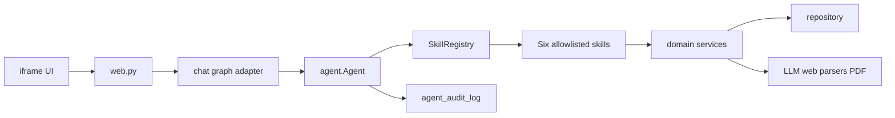
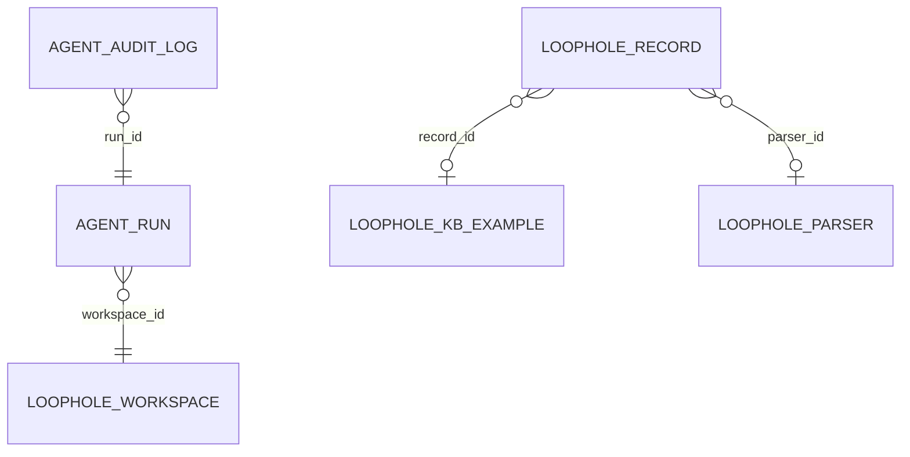
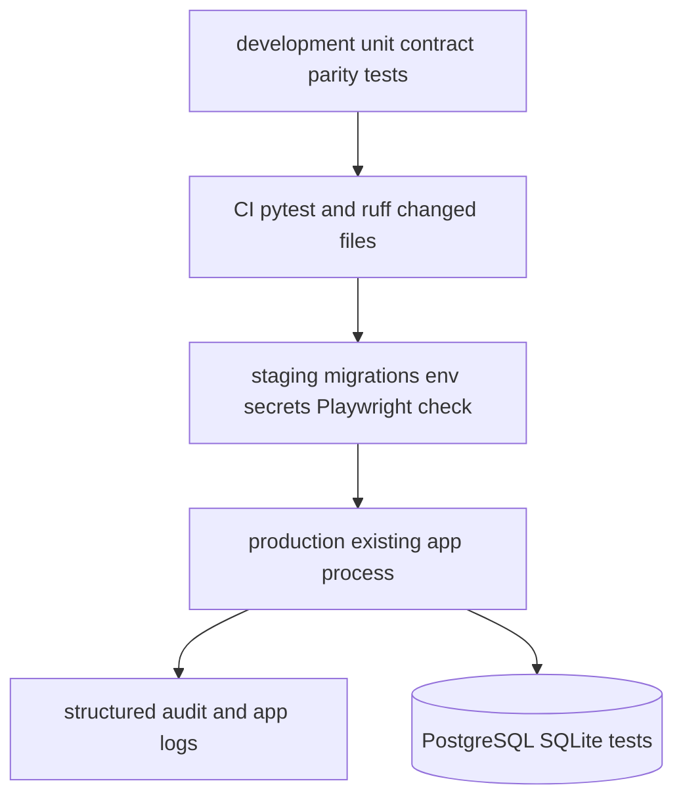

# Architecture Spine — Агент лазеек: Skill-рефакторинг

## Design Paradigm

**Гексагональная архитектура с реестром плагинов.** `agent/` — application core; skills — входящие адаптеры возможностей; `repository`, `parsers`, LLM, файловый экспорт, Nanobot и HTTP/SSE — внешние адаптеры. Зависимости направлены только к core.



## Invariants & Rules

### AD-1 — Целевая граница исполнения агента [ADOPTED]

- **Binds:** CAP-5, FR-1, FR-8, `agent/`, `chat/graph.py`, `chat/nanobot_agent.py`.
- **Prevents:** два параллельных агентских контура и нарушение текущего HTTP/SSE-контракта чата.
- **Rule:** `agent.Agent` владеет состоянием ReAct, лимитом и результатом запуска; `graph.py` только адаптирует существующие `run_chat`/`stream_chat`. Старый `tools_nanobot.py` остаётся shim до прохождения тестов паритета, затем удаляется вместе с его прямыми импортами.

### AD-2 — Реестр skills разрешён конфигурацией [ADOPTED]

- **Binds:** FR-2--FR-8, `agent/registry.py`, `agent/config.json`, все `agent/skills/*`.
- **Prevents:** произвольное выполнение кода при сканировании каталога и расхождение метаданных с доступными tools.
- **Rule:** `SkillRegistry` парсит `SKILL.md` по Agent Skills, но активирует лишь имена из allowlist `config.json`; каждое имя сопоставляется статическому Python factory. Повтор имени, невалидный frontmatter или отсутствующий factory останавливают запуск до вызова LLM.

### AD-3 — Аудит агентского выполнения [ADOPTED]

- **Binds:** NFR-3, запуск агента, tools, миграции и `agent_audit_log`.
- **Prevents:** неаудируемые действия, утечку полного prompt, токенов или Telegram-учётных данных в лог.
- **Rule:** `agent.Agent` записывает redacted structured events `run_started`, `clarification_requested`, `tool_called`, `tool_finished`, `tool_failed`, `run_finished`, `run_limited`; корреляционный `run_id` обязателен. Текстовые payload, секреты и сырые LLM-ответы не сохраняются.

### AD-4 — Classifier — самостоятельный шестой skill [ADOPTED]

- **Binds:** CAP-6, FR-7, `classify.py`, `agent/skills/loophole-classifier`.
- **Prevents:** дублирование классификатора и неограниченный размер контекста LLM.
- **Rule:** skill вызывает доменный сервис `classify.py` для одной записи или фильтрованного batch; размер batch по умолчанию 50 и конфигурируется. Автоматика не изменяет записи с ручным verdict аналитика или ЦККС.

### AD-5 — Владение мутациями и данными

- **Binds:** FR-2--FR-7, `repository.py`, `classify.py`, parser services, export services.
- **Prevents:** обход READ-ONLY запрета DB skill и конфликтующие пути обновления `loophole_record`.
- **Rule:** DB skill выполняет только проверенный одиночный `SELECT`; запись выполняется только через доменные сервисы `save_loophole`, classifier, parser и верификацию. Последние сохраняют источник изменения и никогда не перезаписывают ручной verdict; опубликование положительного решения ЦККС выполняет единый сервис публикации.

### AD-6 — Единый контракт выборки и экспорта

- **Binds:** FR-5, FR-6, `web.py`, `models.py`, reports skill, UI filters.
- **Prevents:** различающиеся фильтры между таблицей, CSV, XLSX и PDF.
- **Rule:** `ReportFilter` — единственный DTO для `bank_slugs`, периода, текста, `only_loophole` и статуса; reports service получает его и возвращает либо файл, либо типизированную доменную ошибку. Лимит XLSX и любых синхронных экспортов — 10 000 записей; PDF при недоступном браузере возвращает объяснённую ошибку без частичного файла.

### AD-7 — Контекст доступа и секреты

- **Binds:** NFR-1, NFR-3, web adapter, parser skills, аудит.
- **Prevents:** обход RBAC tool-вызовом и попадание Telegram-ключей в skill/config/audit.
- **Rule:** HTTP-адаптер передаёт в `AgentRunContext` только идентификаторы пользователя и workspace с разрешениями; каждый mutating tool проверяет этот контекст до доменного сервиса. `TG_API_ID` и `TG_API_HASH` читаются исключительно из окружения процессом Telegram-адаптера и не входят ни в tool arguments, ни в логи.

### AD-8 — UI остаётся отдельным iframe-адаптером

- **Binds:** FR-9, `static/loophole.*`, UX sources.
- **Prevents:** смешение UI-логики с core агента и визуальное расхождение с сайтом.
- **Rule:** изменения UX ограничены `src/bank_audit/loophole/static/`; UI вызывает стабильные HTTP/SSE DTO и не знает о конкретных skills. Токены, тема, доступность, русские подписи и iframe-breakpoints следуют `DESIGN.md` и `EXPERIENCE.md`, которые имеют приоритет при конфликте.

### AD-9 — Планировщик владеет расписанием и состоянием задач

- **Binds:** FR-3.2--FR-3.4, FR-5.3, parser-creator skill, DB skill, `loophole_parser_run` и agent tasks.
- **Prevents:** независимые циклы расписаний, неразличимые статусы запуска и повторное выполнение одной задачи.
- **Rule:** только scheduler service создаёт, включает, отключает и исполняет расписания; skill передаёт ему типизированную команду и читает status через доменный query. Каждая задача имеет persistent id, owner, schedule, state `scheduled|running|succeeded|failed|disabled`, timestamps и idempotency key; повторный запрос с тем же key не создаёт второй запуск.

### AD-10 — Минимальный аудитируемый контекст запуска

- **Binds:** NFR-4.3, SM-3.1, AD-3, `agent_audit_log`.
- **Prevents:** невозможность сопоставить агентский результат с пользователем, запросом и длительностью без хранения секретов.
- **Rule:** события запуска обязательно содержат `run_id`, `user_id`, `workspace_id`, redacted request summary, started_at, finished_at, duration_ms, invoked tool names, terminal result and error code; полные prompt, tool payload, raw LLM output и секреты не хранятся.

### AD-11 — Контракт прогресса SSE

- **Binds:** NFR-3.1, FR-8, UX phase indicator, `Agent.stream`, `chat/graph.py`.
- **Prevents:** молчаливый запуск дольше 15 секунд и несовместимые события между skills.
- **Rule:** adapter передаёт только versioned events `phase`, `progress`, `question`, `tool_call`, `tool_result`, `token`, `records`, `error`, `complete`; `phase` или `progress` отправляется не позднее 15 секунд после принятия запроса и после каждого длительного шага. Payload содержит run_id и локализуемый machine code; UI сам отображает русскую подпись.
### AD-12 — Авторизация fail-closed на границе

- **Binds:** все HTTP endpoints, tools, `AgentRunContext`, RBAC.
- **Prevents:** доступ anonymous или к чужим workspace/parser через прямой вызов endpoint/tool.
- **Rule:** HTTP boundary строит authenticated principal и до создания `AgentRunContext` проверяет membership/role для workspace и ресурса; отсутствие principal, membership или разрешения даёт deny. Единственный authorization service вызывается каждым endpoint и mutating tool; `X-User-Id` fallback запрещён вне тестового dependency override.

### AD-13 — Транзакционный журнал запуска

- **Binds:** AD-3, AD-10, migrations, `agent_audit_log`.
- **Prevents:** потерянный аудит, неидентифицируемый run и ссылка на несуществующую сущность.
- **Rule:** migration создаёт `agent_audit_log(event_id UUID, run_id UUID, user_id, workspace_id, event_type, request_summary, tool_name, terminal_result, error_code, created_at, duration_ms)` с индексом `(run_id, created_at)`. `run_id` генерирует Agent factory; writer использует ту же DB transaction, что и terminal mutation, либо transactional outbox. Ошибка обязательной audit write прекращает mutating operation и возвращает retryable error.

### AD-14 — Контракт фабрики запуска и cutover

- **Binds:** AD-1, `AgentFactory`, `graph.py`, `clarify.py`, `nanobot_agent.py`, `parsers/healer.py`.
- **Prevents:** singleton state/session leakage, неучтённые legacy consumers и небезопасное удаление shim.
- **Rule:** `AgentFactory.create(context)` создаёт отдельный Agent, cancellation scope, audit writer и разрешённые tools на один run; context immutable. Cutover inventory включает clarify prompt loading, `NANOBOT_TOOLS`, `create_nanobot` и healer tools. Удаление shim требует no-import check, без dual-write, parity suite SM-2/SM-4.1 и documented rollback to last released artifact.

### AD-15 — Defence in depth для DB skill

- **Binds:** FR-5, NFR-1, db skill, database credentials.
- **Prevents:** обход строкового SQL guard, дорогие queries и мутацию через DB connection.
- **Rule:** DB skill использует отдельный DB principal без write grants; принимает только parsed single-statement SELECT against allowlisted tables, parameterized values, statement timeout и hard row limit 500. Любое отклонение или limit breach возвращает typed error до execution.

### AD-16 — Атомарный приоритет ручного verdict

- **Binds:** FR-7, CAP-4, classifier, verification service, `loophole_record`.
- **Prevents:** race, в котором classifier перезаписывает verdict, поставленный человеком после чтения записи.
- **Rule:** classifier update выполняется одной conditional UPDATE transaction только когда `verdict_model IS NULL OR verdict_model <> 'manual'` и version совпадает с прочитанной; zero updated rows означает `manual_verdict_preserved`. Ручная верификация повышает version и записывает `verdict_model='manual'`.
## Consistency Conventions

| Concern | Convention |
| --- | --- |
| Naming | Python-пакеты и skill names — kebab-case на диске и snake_case в импортах; tool names начинаются с `audit_`; события аудита — past tense snake_case. |
| Data & formats | Внешние DTO Pydantic; даты ISO 8601; ошибки имеют code, user_message, retryable и run_id; в UI никогда не выводятся технические phase/id. |
| State | `AgentRunContext` неизменяем во время запуска; `AgentResult` содержит answer, tools_used, records, terminal_reason и run_id. |
| Config | Приоритет: аргумент запуска → env → `agent/config.json` → безопасный default; отсутствующий обязательный секрет даёт явную preflight-ошибку. |
| Errors | Clarification — отдельный терминальный результат без расхода итерации; лимит даёт partial result; инструментальная ошибка аудируется и сообщается модели без секретов. |

## Stack

| Name | Version |
| --- | --- |
| Python | >=3.11 |
| FastAPI | >=0.111 |
| SQLAlchemy | >=2.0 |
| Pydantic | >=2.7 |
| nanobot-ai | >=0.2.2,<0.3 |
| Agent Skills specification | web-verified 2026-08-26 |
| Playwright | >=1.45 |
| openpyxl | >=3.1 |

## Structural Seed

```text
src/bank_audit/loophole/
  agent/
    agent.py                 # core lifecycle and ReAct state
    registry.py              # allowlisted metadata plus factories
    config.json              # enabled skills and limits
    skills/                  # six Agent Skills packages
  chat/
    graph.py                 # stable HTTP/SSE adapter
    tools_nanobot.py         # temporary compatibility shim only
  classify.py                # classifier domain service
  reports/                   # ReportFilter and renderers
  static/                    # iframe UI adapter
```





## Capability → Architecture Map

| Capability / Area | Lives in | Governed by |
| --- | --- | --- |
| CAP-5 modular agent | `agent/`, `chat/` | AD-1, AD-2, AD-3, AD-7 |
| Web search and parser skills | `agent/skills/web-search`, parser adapters | AD-2, AD-5, AD-7 |
| DB and reports skills | `agent/skills/db`, `reports/`, `web.py` | AD-5, AD-6 |
| CAP-6 classifier | `agent/skills/loophole-classifier`, `classify.py` | AD-4, AD-5 |
| Existing chat API/SSE | `chat/graph.py`, `web.py` | AD-1, conventions |
| UI module | `static/` | AD-6, AD-8 |

## Deferred

- **Provider/model selection:** configuration owns model names; a specific current model is not fixed by this feature. Revisit when quality, cost or provider policy changes.
- **Retention and access policy for `agent_audit_log`:** event shape is fixed now; retention duration and viewer roles need a security/compliance owner before production migration.
- **Background export jobs:** synchronous cap is sufficient for v1. Revisit when a valid request needs more than 10 000 rows or export exceeds request timeouts.
- **Skill supply chain:** allowlist protects the first-party tree. Signed external skill packages are deferred until third-party installation enters scope.
