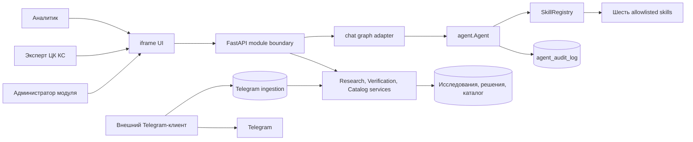
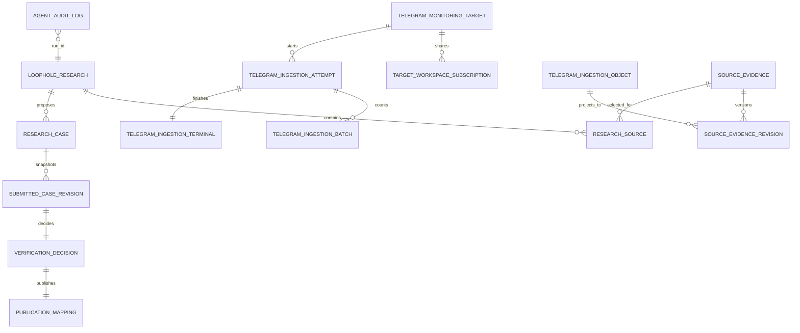
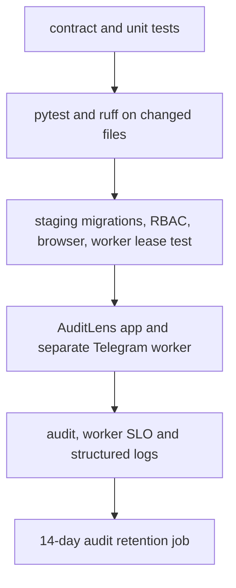

# Architecture Spine — модуль «Уязвимости»

## Design Paradigm

**Модульный монолит AuditLens с гексагональными границами и внешним ingestion-worker для Telegram.** FastAPI-приложение владеет пользовательскими контекстами, доменной моделью исследования, верификацией, каталогом и HTTP/SSE. `agent/` является application core; skills и UI являются адаптерами. Единственный внешний Telegram-клиент владеет Telegram-сессией и сырыми объектами ingestion-контура, но не владеет кейсами, исследованиями или публикацией.



## Inherited Invariants

Решения AD-1--AD-16 приняты в предыдущем spine и сохраняют идентификаторы. Обновление уточняет их правила для полного цикла CAP-1--CAP-6 и добавляет AD-17--AD-28.

## Invariants & Rules

### AD-1 — Целевая граница исполнения агента [ADOPTED]

- **Binds:** CAP-3, CAP-5, FR-1, FR-8, `agent/`, `chat/graph.py`, `chat/nanobot_agent.py`.
- **Prevents:** два параллельных агентских контура и нарушение HTTP/SSE-контракта чата.
- **Rule:** `agent.Agent` владеет состоянием ReAct, стандартным лимитом 20 итераций и результатом запуска; `graph.py` только адаптирует существующие `run_chat` и `stream_chat`. Уточнение не расходует итерацию, а достижение лимита возвращает объяснённый partial result. `tools_nanobot.py` остаётся compatibility shim до прохождения тестов паритета, затем удаляется вместе с прямыми импортами.

### AD-2 — Реестр skills разрешён конфигурацией [ADOPTED]

- **Binds:** CAP-5, CAP-6, FR-2--FR-8, `agent/registry.py`, `agent/config.json`, `agent/skills/*`.
- **Prevents:** произвольное выполнение кода при сканировании каталога и расхождение метаданных с доступными tools.
- **Rule:** `SkillRegistry` читает `SKILL.md`, но активирует только имена из allowlist `config.json`, сопоставленные статическим Python factory. Повтор имени, невалидный frontmatter или отсутствующий factory останавливают запуск до вызова LLM.

### AD-3 — Аудит агентского и доменного выполнения [ADOPTED]

- **Binds:** NFR аудита, агент, исследование, решение ЦК КС, публикация, миграции и `agent_audit_log`.
- **Prevents:** неаудируемые действия, утечку полного prompt, токенов или Telegram-учётных данных.
- **Rule:** AuditLens пишет redacted structured events с `run_id` для запуска, уточнения, tool call, ошибки, регистрации/смены статуса цели, research handoff, решения и публикации. Внешний worker не пишет `agent_audit_log`: его канонический журнал — immutable `telegram_ingestion_attempt`; AuditLens `IngestionAuditProjector` по `attempt_id` и `worker_run_id` создаёт ровно одну redacted summary-запись через outbox. Полные prompts, payload инструментов, raw LLM-ответы и секреты не сохраняются. Записи хранятся 14 дней и доступны только администратору модуля.

### AD-4 — Classifier является самостоятельным шестым skill [ADOPTED]

- **Binds:** CAP-6, FR-7, `classify.py`, `agent/skills/loophole-classifier`.
- **Prevents:** дублирование классификатора, неограниченный контекст LLM и перезапись ручного решения.
- **Rule:** skill вызывает единственный доменный сервис для одного кейса либо фильтрованного batch. Размер batch по умолчанию 50 и конфигурируется. Автоматика не изменяет ручной verdict аналитика или решение ЦК КС.

### AD-5 — Владение мутациями и состоянием кейса

- **Binds:** CAP-2--CAP-6, `repository.py`, classifier, parser services, research, verification и publication services.
- **Prevents:** обход READ-ONLY запрета DB skill, смешение чернового исследования с каталогом и конфликтующие записи `loophole_record`.
- **Rule:** DB skill выполняет только проверенный одиночный `SELECT`. AI-агент сохраняет результат через `ResearchService` как кандидат изолированного исследования, а не напрямую в каталог. `SourceEvidenceService` создаёт только redacted evidence с provenance, но не создаёт research/case автоматически. Только `PublicationService` создаёт или связывает `loophole_record` после положительного неизменяемого решения ЦК КС. Каждый mutating service передаёт actor, `run_id` и idempotency key.

### AD-6 — Единый контракт выборки и экспорта

- **Binds:** CAP-2, CAP-3, FR-5, FR-6, `web.py`, models, reports skill и UI filters.
- **Prevents:** различающиеся фильтры между таблицей, CSV, XLSX, PDF и classifier.
- **Rule:** versioned `ReportFilter` содержит обязательный `scope=catalog|research` и является единственным DTO для банка, периода, текста, `only_loophole`, `case_type` и `verification_status`. `catalog` допускает только published confirmed cases; `research` требует `research_id` и использует канонический verification namespace. Все форматы строятся из одного снимка и возвращают применённые фильтры. XLSX более 10 000 строк отклоняется; CSV поддерживает всю доступную выборку; PDF без Playwright возвращает типизированную ошибку с предложением CSV/XLSX.

### AD-7 — Контекст доступа и секреты

- **Binds:** CAP-1, CAP-4, NFR безопасности, web adapter, skills и аудит.
- **Prevents:** обход RBAC tool-вызовом, доступ к чужому workspace и попадание Telegram-ключей в AuditLens.
- **Rule:** `IdentityAdapter` проверяет OIDC JWT по настроенным issuer, audience и JWKS и выдаёт только immutable `Principal(subject_id)`. `AuthorizationService` читает authoritative `workspace_membership` и `role_assignment` из БД для каждого request, mutating tool и scheduled execution; revocation действует до следующей команды без доверия к workspace/role claim токена. `TG_API_ID`, `TG_API_HASH`, session-string и MFA доступны только внешнему Telegram-клиенту через его environment и не входят в tool arguments, базу AuditLens или логи.

### AD-8 — Три пользовательских контекста не смешиваются

- **Binds:** CAP-1--CAP-4, UI, UI DTO и маршруты API.
- **Prevents:** преждевременное появление кандидатов в общей базе, неявный доступ к очереди ЦК КС и смешение состояний экрана.
- **Rule:** каталог, новое AI-исследование и очередь верификации являются отдельными маршрутами и DTO. UI может перейти между ними навигацией, но один API-ответ не объединяет их наборы данных. Текущий UX-артефакт покрывает каталог и чат; перед frontend-реализацией CAP-1--CAP-4 он должен быть расширен отдельными сценариями исследования и очереди.

### AD-9 — Планировщики имеют раздельные доменные владения

- **Binds:** FR-3.2--FR-3.4, parser-creator skill, обычные web parsers и Telegram ingestion.
- **Prevents:** два scheduler-а для одной цели, неразличимые статусы запуска и перенос Telegram-сессии в веб-процесс.
- **Rule:** существующий scheduler service остаётся владельцем расписаний обычных web parsers и scheduled DB tasks. DB task хранит allowlisted named query/`ReportFilter`, workspace, service actor, expiry и enable state; raw SQL по расписанию запрещён, выполнение всегда использует read-only principal и пишет audit event. Внешний Telegram-клиент единолично владеет расписанием и состоянием Telegram-обходов. Skill только создаёт или возвращает зарегистрированную цель, а другой административный интерфейс меняет её `active|inactive`.

### AD-10 — Минимальный аудитируемый контекст запуска [ADOPTED]

- **Binds:** NFR наблюдаемости, AD-3, `agent_audit_log`.
- **Prevents:** невозможность сопоставить результат с субъектом и длительностью без хранения секретов.
- **Rule:** событие содержит `run_id`, actor, workspace, redacted request summary, timestamps, duration, tool names, terminal result и error code. В UI не выводятся технические phase/id.

### AD-11 — Контракт прогресса SSE [ADOPTED]

- **Binds:** NFR-3.1, FR-8, UI phase indicator, `Agent.stream`, `chat/graph.py`.
- **Prevents:** молчаливый запуск дольше 15 секунд и несовместимые события skills.
- **Rule:** adapter передаёт versioned `phase`, `progress`, `question`, `tool_call`, `tool_result`, `token`, `records`, `error`, `complete`. `phase` или `progress` отправляется в течение 15 секунд после принятия запроса и после каждого длительного шага; payload содержит `run_id` и локализуемый machine code.

### AD-12 — Авторизация fail-closed на границе [ADOPTED]

- **Binds:** все endpoints, tools, `AgentRunContext`, RBAC, CAP-1 и CAP-4.
- **Prevents:** доступ anonymous, доступ к чужому workspace и выдачу решения ЦК КС через прямой endpoint.
- **Rule:** единственный authorization service проверяет authenticated principal, membership и разрешение до вызова endpoint или mutating tool. Отсутствие любого элемента означает deny. `X-User-Id` fallback допускается только в тестовом dependency override.

### AD-13 — Транзакционный журнал запуска и retention

- **Binds:** AD-3, AD-10, migrations, `agent_audit_log`.
- **Prevents:** потерянный аудит, неидентифицируемый run и неограниченное хранение audit data.
- **Rule:** writer использует ту же транзакцию, что terminal mutation, либо transactional outbox. Ошибка обязательной audit write прекращает mutating operation. `agent_audit_log` append-only для application roles; только retention role вызывает ограниченную функцию удаления записей старше 14 дней. Daily retention job имеет отдельный service identity, записывает aggregate result в `audit_retention_run` и поднимает alert при ошибке.

### AD-14 — Контракт фабрики запуска и cutover [ADOPTED]

- **Binds:** AD-1, `AgentFactory`, `graph.py`, `clarify.py`, `nanobot_agent.py`, `parsers/healer.py`.
- **Prevents:** singleton state/session leakage, неучтённые legacy consumers и небезопасное удаление shim.
- **Rule:** `AgentFactory.create(context)` создаёт отдельные Agent, cancellation scope, audit writer и allowlisted tools на один run; context immutable. Удаление shim требует no-import check, parity suite SM-2/SM-4.1, отсутствия dual-write и документированного rollback.

### AD-15 — Defence in depth для DB skill [ADOPTED]

- **Binds:** FR-5, NFR безопасности, db skill и database credentials.
- **Prevents:** обход строкового SQL guard, дорогие запросы и мутацию через DB connection.
- **Rule:** DB skill использует отдельный DB principal без write grants, принимает parsed single-statement `SELECT` только против allowlisted tables, parameterized values, statement timeout и hard row limit 500.

### AD-16 — Атомарный приоритет ручного verdict [ADOPTED]

- **Binds:** FR-7, CAP-4, classifier, verification service и case state.
- **Prevents:** race, в котором classifier перезаписывает verdict, поставленный человеком после чтения записи.
- **Rule:** classifier делает conditional update только при отсутствии manual state и совпадении версии. Ноль обновлённых строк означает `manual_verdict_preserved`; ручная маркировка и решение ЦК КС повышают версию.

### AD-17 — Внешняя граница Telegram ingestion [ADOPTED]

- **Binds:** OQ-13, FR Telegram-мониторинга, TelegramMonitoringTarget v1, `telegram_ingestion_*`.
- **Prevents:** прямую публикацию из Telegram, утечку сессии и совместное владение сырыми данными.
- **Rule:** внешний клиент читает активные цели и записывает только immutable PII-masked ingress objects, попытки и checkpoint в отдельный ingestion-контур. У клиента нет прав на исследования, верификацию, каталог или audit log. `SourceEvidenceService` AuditLens идемпотентно создаёт доступное evidence с provenance; только явная команда аналитика создаёт `loophole_research` и связывает evidence как `research_source`. Ни worker, ни projector не создают candidate, request или подтверждённый кейс.

### AD-18 — Явная state machine исследования, верификации и публикации [ADOPTED]

- **Binds:** CAP-3, CAP-4, CaseContract v1, research, verification и catalog entities.
- **Prevents:** смешение изолированного исследования с общей базой и дубли при повторной публикации.
- **Rule:** `research_case.lifecycle_status` использует только `draft|submitted`; immutable `submitted_case_revision` содержит case revision, immutable `source_evidence_revision` IDs, их HMAC fingerprints, actor, time и command key. `verification_status` использует только CaseContract v1: `not_submitted|pending|confirmed|not_confirmed`. Единственное conditional решение создаётся для `pending` snapshot с expected version; проигравший конкурентный запрос возвращает уже сохранённый final result без side effect. Положительное решение создаёт `publication_status=pending`; `PublicationService` атомарно создаёт publication mapping с unique `submitted_case_revision_id`, затем связывает или создаёт каталог по exact `CaseFingerprint v1`. Fuzzy dedupe никогда не сливается автоматически: exact match связывает новую provenance с существующим каталогом, иначе создаётся отдельная запись.

### AD-19 — Администрирование роли ЦК КС и просмотр аудита [ADOPTED]

- **Binds:** CAP-1, CAP-4, RBAC, `agent_audit_log` и UI администрации.
- **Prevents:** неуправляемое назначение роли, скрытую двухэтапную процедуру и чтение аудита аналитиком.
- **Rule:** администратор модуля через отдельную allowlisted operation назначает и отзывает роль ЦК КС у пяти экспертов. В v1 второй подтверждающий шаг не нужен. Только администратор модуля просматривает `agent_audit_log`; изменения роли и доступ к журналу сами аудируются.

### AD-20 — Singleton, checkpoint и 24-hour SLO Telegram [ADOPTED]

- **Binds:** TelegramMonitoringTarget v1, внешний клиент, `telegram_ingestion_attempt`, checkpoint и monitoring.
- **Prevents:** два одновременных обхода, потерю инкремента, нарушение SLO и потерю прогресса при failover.
- **Rule:** worker захватывает global session lease на deployment `telegram_session_id` и target lease с generation-bound fencing token. Создание attempt атомарно сохраняет durable `initial_checkpoint` sentinel с cursor `null` и sequence `0` до первого Telegram read; все последующие writes и checkpoint compare token и target generation. Объекты устойчиво сохраняются до checkpoint в одной транзакции. Deactivate повышает generation и инвалидирует lease; registry transaction terminalize-ит attempt, а worker со stale fence прекращает write. Reactivate продолжает initial/incremental sync с durable checkpoint. Новая valid target registration создаётся active даже до подтверждённого membership/access; её resolver-only attempt и недоступность также учитываются в 24-hour SLO. Успешная первичная синхронизация читает всю доступную историю, последующая сохраняет только новые объекты по versioned source key. Для каждой active цели attempt начинается не реже раза в скользящие 24 часа; результат содержит режим, checkpoint до/после, количества, длительность и код ошибки.

### AD-21 — Проверенная identity, DCL и deployment perimeter [ADOPTED]

- **Binds:** OIDC, RBAC, DB grants, worker deployment и operations runbook.
- **Prevents:** spoofed principal, cross-schema write и неограниченный сетевой доступ worker-а.
- **Rule:** `auditlens_app` владеет domain tables и `TargetRegistryService`; `loophole_readonly` читает только allowlisted views; `telegram_worker` читает active-target view и вызывает только fenced ingest functions plus `resolve_provisional_target`; `ingestion_reaper` вызывает только expired-attempt terminal function и читает attempt-age view без payload; `audit_retention` выполняет только bounded audit and ingestion-journal purge functions and aggregate runs. DCL запрещает worker-у direct table write, `loophole_record`, research, verification и `agent_audit_log`. Worker не имеет inbound listener, shell/UI доступа к payload или egress кроме TLS-verified PostgreSQL и Telegram; image, secret injection/rotation, CA validation and alert owner являются обязательными deployment evidence.

### AD-22 — Immutable command ledger lifecycle [ADOPTED]

- **Binds:** submitted revision, verification decision, publication mapping и catalog provenance.
- **Prevents:** решение по изменённому кандидату, два противоположных решения и publication retry duplicate.
- **Rule:** `CommandLedger v1` уникален по `(namespace, command_key)`; namespaces `submit`, `decision`, `publication`, `target_registration`, `target_subscription` и `db_schedule` не пересекаются. DB constraint допускает ровно один submitted snapshot на `(research_case_id, revision)`, одно final decision на snapshot и одно publication mapping на confirmed decision. Final decision append-only для application roles; publication retry использует тот же `publication` command key и не создаёт новый side effect.

### AD-23 — Worker journal, audit relay и PII minimization [ADOPTED]

- **Binds:** `telegram_ingestion_attempt`, `agent_audit_log`, `SourceEvidenceService` и PII mask.
- **Prevents:** grant worker-а на audit, неаудируемый attempt и сохранение полного Telegram payload.
- **Rule:** worker создаёт `worker_run_id`, immutable attempt header, append-only batch events и ровно один terminal event. Fenced terminal transaction создаёт unique audit outbox row; projector atomically inserts unique inbox/origin-attempt audit summary keyed by `(worker_run_id, attempt_id)`. PII sanitizer применяется до persistence и до любого LLM call; raw full body не хранится. Unlinked redacted ingress object удаляется через 14 дней, а linked evidence хранит только redacted projection и provenance.

### AD-24 — Versioned Telegram identity и claim protocol [ADOPTED]

- **Binds:** `TelegramObjectIdentity v1`, ingestion projector, `source_evidence` и research source linking.
- **Prevents:** duplicate transform, endless poison replay, stale writer и неявное создание исследования.
- **Rule:** identity состоит из `(logical_account_id, canonical_peer_id, message_id, optional_comment_id, revision)` и образует versioned stable source key; remote peer aliases нормализуются target registry до `canonical_peer_id`. Global target имеет одну или более `workspace_subscription`; research может выбрать evidence только при active subscription своего workspace. Projector атомарно claim-ит object в `new|processing|linked|retryable_failed|quarantined` с `claim_token` и `claim_expires_at`; reaper reclaim-ит только истёкший claim до retention cutoff. Unique `origin_ingestion_object_id` связывает ровно одно `source_evidence`. Poison object quarantine-ится с кодом и controlled replay. Только аналитик создаёт research и явной командой связывает выбранные evidence с ним.

### AD-25 — Revisioned evidence и deterministic CaseFingerprint [ADOPTED]

- **Binds:** `source_evidence_revision`, submitted snapshot, catalog provenance и exact dedupe.
- **Prevents:** решение по mutable evidence, неявный fuzzy merge и повторную publication одного snapshot.
- **Rule:** evidence append-only: изменение создаёт новую revision, а submitted snapshot хранит immutable revision IDs и HMAC fingerprints. `CaseFingerprint v1` равен SHA-256 canonical JSON версии, `case_type`, bank/product scope, category и отсортированных evidence HMAC. Совпадение этого ключа является единственным automatic provenance link; semantic/fuzzy similarity только сигнализируется человеку и не меняет каталог.

### AD-26 — Immutable worker events и atomic relay [ADOPTED]

- **Binds:** attempt header/batch/terminal events, audit outbox, audit inbox и `IngestionAuditProjector`.
- **Prevents:** mutable terminal counters, duplicate audit summary и потерю terminal event между worker и AuditLens.
- **Rule:** `telegram_ingestion_attempt`, `telegram_ingestion_batch` и `telegram_ingestion_terminal` append-only; terminal event и `ingestion_audit_outbox` с unique `attempt_id` коммитятся в одной fenced transaction. Projector доставляется at-least-once, но в своей transaction создаёт `audit_inbox` и `agent_audit_log` с unique origin attempt, поэтому наблюдаемый summary exactly-once.

### AD-27 — Authoritative membership и scheduled execution [ADOPTED]

- **Binds:** `workspace_membership`, role assignment, target subscriptions, scheduled DB task и result ownership.
- **Prevents:** stale JWT grant, cross-workspace evidence и выполнение schedule после revoke.
- **Rule:** JWT идентифицирует subject, но не авторизует workspace или роль. Database membership/role assignment проверяются при каждой команде и при каждом scheduled run. `ScheduledQueryContract v1` фиксирует named query ID/version, workspace, owner, result owner, expiry и allowlisted output; при revoke/expiry scheduler пропускает run с audit code и не использует сохранённые полномочия.

### AD-28 — Fail-closed PII sanitation [ADOPTED]

- **Binds:** `pii_mask.py`, worker, attachments, evidence и LLM boundary.
- **Prevents:** reversible replacements в persistence, прохождение неизвестных данных в LLM и ложное утверждение полной маскировки.
- **Rule:** существующий regex `pii_mask` применяется как компонент sanitizer-а, но не считается достаточной гарантией. Его replacement map остаётся только в памяти. Versioned sanitizer классифицирует text и attachments; detector error, uncertain result или unsupported attachment создаёт metadata-only `quarantined` object без body, LLM или evidence path. Только successful policy version создаёт redacted projection и keyed HMAC; full raw body не хранится.

### AD-29 — Fenced terminalization и восстановление попыток [ADOPTED]

- **Binds:** AD-20, AD-23, AD-26, target registry, attempt reaper и audit relay.
- **Prevents:** terminal event без outbox, зависшую после crash попытку и запись stale worker после deactivate.
- **Rule:** fenced worker может коммитить batch, checkpoint и normal terminal только при точном совпадении `(target_id, generation, fence_token)`. Переход `active(g) -> inactive(g+1)` сериализуется с этими writes: та же registry transaction создаёт terminal `target_deactivated` и unique outbox для каждой non-terminal попытки поколения `g`; worker, потерявший fence, только прекращает работу и не создаёт terminal. Attempt header всегда содержит durable `initial_checkpoint(sequence=0,cursor=null)` до Telegram read, поэтому system actor `ingestion_reaper` условно закрывает любой non-terminal `running` attempt с истекшим lease как `lease_expired|abandoned`, включая zero-batch attempt; его transaction атомарно вставляет terminal и тот же unique outbox. Новый worker начинает новый attempt только после terminalization старого. Ровно одна terminal row и один outbox обеспечиваются unique `attempt_id`; crash after header/before first batch, crash after batch/before terminal, stale write и deactivate во время batch являются обязательными acceptance cases.

### AD-30 — Payload-bound ledger и canonical CaseFingerprint [ADOPTED]

- **Binds:** AD-22, AD-25, submit, decision, publication и catalog provenance.
- **Prevents:** повтор command key с другим запросом, неразличимые HMAC rotation и различный hash одинакового business case.
- **Rule:** `CommandLedger v1` хранит `(namespace, command_key, canonical_request_sha256, state, result_type, result_ref, result_sha256)`; повтор той же пары с иным hash всегда возвращает `idempotency_payload_mismatch` без side effect, с тем же hash возвращает сохранённый результат или typed `idempotency_in_progress`. Evidence fingerprint равен object `{algorithm: "hmac-sha256", hmac_key_id, digest}`. `hmac_key_id` не является секретом; rotation оставляет immutable historical revisions проверяемыми, новые revisions используют active key, а controlled re-HMAC создаёт новую evidence revision и новый snapshot, не переписывая прежние данные. `CaseFingerprint v1` включает schema version, `case_type`, global catalog scope, canonical `bank_id`, `product_id`, `category_id`, `taxonomy_version` и отсортированный массив полных evidence fingerprint objects. Canonical JSON кодируется UTF-8, ключи сортируются лексикографически, строки нормализуются NFC и trim-ятся; ID имеют нормализованный lowercase ASCII format, `null` означает not-applicable, а literal `unknown` означает known-unknown. Cross-key fingerprints никогда не создают automatic provenance link. Golden fixtures являются частью контракта.

### AD-31 — Subscription revoke и claim compare-and-set [ADOPTED]

- **Binds:** AD-24, AD-27, research, verification, publication и evidence projector.
- **Prevents:** публикацию после revoke и completion устаревшего projector-а после reclaim.
- **Rule:** evidence является global, но его выбор и submission draft разрешены только при active `workspace_subscription`. Submitted snapshot pin-ит `subscription_id` и `subscription_grant_version` как immutable `evidence_access_grant`. Selection и submit берут subscription row `FOR UPDATE`, требуют active current grant version и commit-ятся в той же transaction; revoke берёт тот же lock и инкрементирует grant version. Поэтому race serializes: snapshot целиком admitted до revoke получает grant, а selection/submission после revoke получает typed deny без side effect. Revoke не оживляет и не меняет draft, но запрещает его submit до re-subscribe и нового explicit selection. Уже admitted snapshot не зависит от будущего subscription revoke: решение, обязательная automatic publication после positive decision и её idempotent retry продолжаются по immutable evidence_access_grant, что сохраняет FR-12.4. Completion/failure evidence projector-а выполняется одним compare-and-set: `WHERE claim_token = :token AND claim_expires_at >= now() AND status = 'processing'`; иначе он возвращает `claim_lost` без evidence/status mutation. Reaper и reclaimer используют тот же locking model; stale completer versus reclaimer является обязательным acceptance case.

### AD-32 — Delivery horizon и retention worker-journal [ADOPTED]

- **Binds:** AD-23, AD-26, `ingestion_audit_outbox`, `audit_inbox` и operations runbook.
- **Prevents:** повторный audit после purge, бесконечный рост relay и silent loss недоставленного terminal event.
- **Rule:** immutable attempt header/batch/terminal хранится 90 дней. Outbox и inbox хранятся не менее 31 дня после terminal; delivery horizon равен 30 дням. Недоставленный outbox после 7 дней переносится в redacted `ingestion_audit_dead_letter`, создаёт alert и может быть replay-ed только по immutable `outbox_id` до конца horizon. После horizon relay отказывает `expired_outbox` без новой audit mutation; purge outbox/inbox разрешён только после подтверждённого terminal status и horizon. Поэтому unique inbox существует весь допустимый период at-least-once delivery, даже если `agent_audit_log` очищается через 14 дней.

### AD-33 — Reproducible sanitization и строгий quarantine metadata [ADOPTED]

- **Binds:** AD-28, worker, ingress object, PII boundary и controlled replay.
- **Prevents:** сохранение PII в metadata и различный sanitizer verdict при одинаковом policy version.
- **Rule:** immutable `SanitizationResult v1` содержит `policy_version`, `policy_config_digest`, outcome `approved|quarantined`, closed-enum `reason_code`, `input_kind`, `media_type_code`, optional parser version и approved projection fingerprint. Изменение parser/configuration создаёт новую policy version; replay quarantine возможен только явной `sanitization_replay` command с audit и создаёт новую object revision, не переписывая старую. `QuarantineMetadata v1` допускает только opaque IDs и keyed fingerprint object `{algorithm, hmac_key_id, digest}` для source identity, UTC timestamp, non-negative size, fixed media-type code, reason code и policy/config identifiers; plain/hash-only digest запрещён. Body, caption, filename, URL, peer title, preview, OCR/error text и arbitrary strings запрещены Pydantic `extra=forbid`, DB schema и logging policy.

### AD-34 — Deterministic scheduled execution и target reconciliation [ADOPTED]

- **Binds:** AD-20, AD-24, AD-27, `ScheduledQueryContract v1` и `TelegramMonitoringTarget v1`.
- **Prevents:** выполнение schedule при revoke, результат в чужом workspace и duplicate target из alias/rename.
- **Rule:** scheduler запускает named query только когда owner и result owner оба active members одного contract workspace, owner имеет `db_schedule_execute` для pinned query version, result owner имеет `scheduled_result_read`, а expiry не наступил; иначе он создаёт one `schedule_skipped_<reason>` audit event и не выполняет query. `ScheduledResult v1` имеет run correlation, workspace, query version, owner/result owner, private internal destination, reader ACL ровно для этих two subjects, TTL не более 24 часов; external/foreign-workspace destination и automatic export запрещены. Target registration сначала создаёт active provisional record по normalized `t.me|@alias|invite` address и configured non-secret `logical_account_id`, но без membership/access или session material, и возвращает его idempotently; повтор неактивной записи не меняет lifecycle. Каждая active provisional цель получает resolver-only attempt и availability audit не реже 24 часов. Resolver serializably получает immutable remote peer ID: он atomically promotes provisional record to canonical target или при conflict переносит subscriptions и alias history в already canonical target, превращая исходную запись в redirect alias; acquisition/checkpoint/evidence идут только у canonical target. Global unique `(logical_account_id, canonical_peer_id)` гарантирует один поток even for concurrent aliases. Rename/migration обновляют immutable alias map. `t.me == @alias`, deferred access, rename/migration, resolver conflict and concurrent registration являются обязательными acceptance cases.

### AD-35 — Controlled registration и resolver merge Telegram target [ADOPTED]

- **Binds:** AD-17, AD-21, AD-22, AD-24, AD-34, `TargetRegistryService` и `workspace_subscription`.
- **Prevents:** worker direct table privileges, transport ambiguity, duplicate workspace grant и target без доступа после merge.
- **Rule:** Telegram skill вызывает application `TargetRegistryService.register_target` только от проверенного user principal. Одна domain transaction reservation-ит `CommandLedger(namespace=target_registration)`, проверяет canonical request hash и dereference-ит normalized alias/redirect до canonical target before create/return; она меняет только `TelegramMonitoringTarget v1`, alias index и собственный audit, но никогда не создаёт/изменяет `workspace_subscription`, lifecycle или membership. Повтор с тем же key/payload возвращает тот же canonical target, с иным payload -- `idempotency_payload_mismatch`, inactive target не реактивируется. Только `telegram_worker` получает EXECUTE на SECURITY DEFINER function `resolve_provisional_target(target_id,generation,resolver_fence_token,attempt_id,remote_peer_id)`: она проверяет active target, current resolution fence и no direct-table caller, serializably promotes или merges target и переносит уже существующие subscriptions with latest explicit intent. Function terminalize-ит тот же `mode=resolver_only` worker attempt c code `target_resolved|target_merged` и в той же transaction вставляет единственный `ingestion_audit_outbox(attempt_id)`; отдельного target-registry outbox нет. Unavailable resolution закрывается normal fenced terminal той же attempt/outbox. Worker не получает `agent_audit_log`/catalog/research grant и не вызывает FastAPI. Resolver merge, repeat registration via old alias, inactive repeat и stale resolution fence являются обязательными acceptance cases.

### AD-36 — Resolver attempt и canonical subscription invariant [ADOPTED]

- **Binds:** AD-20, AD-26, AD-32, AD-35, target registry and audit projector.
- **Prevents:** collision resolver outbox с terminal outbox и workspace grant на redirect alias без evidence.
- **Rule:** `resolver_only` является режимом обычного `telegram_ingestion_attempt`, поэтому header, initial checkpoint sentinel, terminal и audit relay имеют один `attempt_id`. `resolve_provisional_target` завершает этот attempt atomically only for successful promotion/merge; `ingestion_audit_outbox` остаётся unique строго по `attempt_id`, а `IngestionAuditProjector` не различает origin type и создаёт exactly-one summary. `target_alias_index(normalized_address,logical_account_id)` всегда указывает на canonical root. Separate `TargetAccessService.grant_workspace_subscription` и resolver merge сначала lock/dereference index, а `workspace_subscription` содержит only canonical root ID; DB trigger rejects redirect target ID. Target registry locks in one order: alias index by normalized address, canonical target rows by UUID, attempt by UUID, subscriptions by workspace UUID, outbox last; registration/subscription reserve their own CommandLedger row before this shared suffix. Deadlock/serialization retry остаётся typed retryable и использует исходный command key/fence без изменения intent. Merge в одной transaction обновляет index, переносит/dedupe-ит grants и reply возвращает canonical ID. Следовательно old alias, concurrent resolution и retry не могут создать второй subscription, checkpoint или evidence path.

### AD-37 — Отдельное выдача workspace доступа к Telegram evidence [ADOPTED]

- **Binds:** FR-4.2, OQ-13, AD-22, AD-24, AD-31, AD-35 and AD-36.
- **Prevents:** изменение чужой записи Telegram skill-ом и неявный доступ workspace к global evidence.
- **Rule:** `TargetAccessService.grant_workspace_subscription` вызывается только из отдельного управляющего интерфейса active `module_admin` с capability `target_subscription_manage` в этом workspace, а не Telegram skill-ом. Он reservation-ит `CommandLedger(namespace=target_subscription)`, dereference-ит target alias до canonical logical root и upsert-ит единственную `workspace_subscription(workspace_id,canonical_target_id)` с `grant_version`/`intent_sequence` и redacted audit. Grant разрешён для active provisional или resolved canonical target, но не даёт evidence path до successful ingestion; subscription на redirect ID, cross-workspace request или отсутствие capability возвращают typed deny. `revoke_workspace_subscription` имеет тот же RBAC/lock contract, переводит grant в revoked и increment-ит grant version, поэтому AD-31 блокирует только новые selection/submission, а admitted snapshot сохраняет FR-12.4 path. Registration target, Telegram account membership, active/inactive lifecycle и workspace evidence access являются четырьмя разными наблюдаемыми операциями. Merge переносит только уже выданные subscriptions; registration never creates one. Повтор grant/revoke с тем же key/payload возвращает сохранённый result. Только active subscription и существующее ingested evidence позволяют выбрать его для исследования.

## Consistency Conventions

| Concern | Convention |
| --- | --- |
| Contracts | Внешние DTO Pydantic v2. `CaseContract v1`, `ReportFilter v1`, `TelegramMonitoringTarget v1`, `SubmittedCaseRevision v1`, `TelegramObjectIdentity v1`, `ScheduledQueryContract v1`, `CaseFingerprint v1`, `SanitizationResult v1`, `QuarantineMetadata v1` и `ScheduledResult v1` являются versioned contracts. |
| Naming | Python packages используют snake_case; disk skill names используют kebab-case; audit events используют past-tense snake_case. |
| Time | Timestamps в UTC ISO 8601; пользовательская локализация выполняется UI. |
| Errors | Ошибка имеет `code`, `user_message`, `retryable`, `run_id` при наличии запуска. |
| Idempotency | Любая внешняя доставка, регистрация цели, отправка на верификацию и публикация имеют явный idempotency key или устойчивый natural key. |
| Audit redaction | До сериализации исключаются secrets, session material, full prompt, raw LLM output и неограниченный raw Telegram text. |

## Stack

| Name | Version / source of truth |
| --- | --- |
| Python | >=3.11, `pyproject.toml` |
| FastAPI | >=0.111, `pyproject.toml` |
| SQLAlchemy | >=2.0, `pyproject.toml` |
| Pydantic | >=2.7, `pyproject.toml` |
| nanobot-ai | >=0.2.2,<0.3, `pyproject.toml` |
| Playwright | >=1.45, `pyproject.toml` |
| openpyxl | >=3.1, `pyproject.toml` |
| Agent Skills | совместимость проверяется по `SKILL.md` metadata и contract tests, конкретная внешняя версия не фиксируется feature-архитектурой |

## Structural Seed

```text
src/bank_audit/loophole/
  agent/                         # ReAct core, registry, six skills
  application/
    research_service.py           # isolated research and candidate cases
    verification_service.py       # queue and immutable CCKS decision
    publication_service.py        # deterministic catalog publication
    source_evidence_service.py    # claimed ingress object -> revisioned evidence
    ingestion_audit_projector.py  # worker attempt -> domain audit summary
  chat/                           # stable HTTP/SSE adapter and temporary shim
  authorization.py                # Principal and role policy
  reports/                        # ReportFilter and renderers
  static/                         # iframe routes and UI adapters
  telegram_worker/                # separate deployable, never child process of web app
migrations/
  042_loophole_case_lifecycle.sql
  043_loophole_telegram_ingestion.sql
  044_loophole_audit_security.sql
```





## Capability → Architecture Map

| Capability | Primary boundary | Governing ADs |
| --- | --- | --- |
| CAP-1 вход и навигация | authorization, UI routes | AD-7, AD-8, AD-12, AD-19, AD-21, AD-27, AD-37 |
| CAP-2 база и экспорт | catalog, reports, ReportFilter | AD-5, AD-6, AD-15 |
| CAP-3 новое AI-исследование | agent, research service | AD-1, AD-3, AD-5, AD-18, AD-22, AD-24, AD-25, AD-27, AD-30, AD-31 |
| CAP-4 верификация и публикация | verification, publication | AD-3, AD-5, AD-12, AD-16, AD-18, AD-19, AD-22, AD-25, AD-30, AD-31 |
| CAP-5 модульный агент | agent, registry, skills | AD-1--AD-3, AD-7, AD-10, AD-11, AD-14 |
| Telegram monitoring | registry, external worker, evidence projector | AD-7, AD-9, AD-17, AD-20, AD-21, AD-23, AD-24, AD-26, AD-28, AD-29, AD-32--AD-37 |
| CAP-6 classifier | classifier service and skill | AD-4, AD-6, AD-16 |

## Deferred

- **Асинхронные тяжёлые экспорты:** v1 использует синхронный экспорт в ограничениях PRD. Вернуться, когда доступная выборка или rendering превысят request budget.
- **Подпись сторонних skills:** allowlist покрывает first-party tree. Подпись и supply-chain policy нужны только при установке внешних skills.
- **Физическое размещение ingestion schema:** владение и права уже определены AD-17; выделять отдельную БД вместо отдельной схемы следует только при требовании изоляции от security owner.
