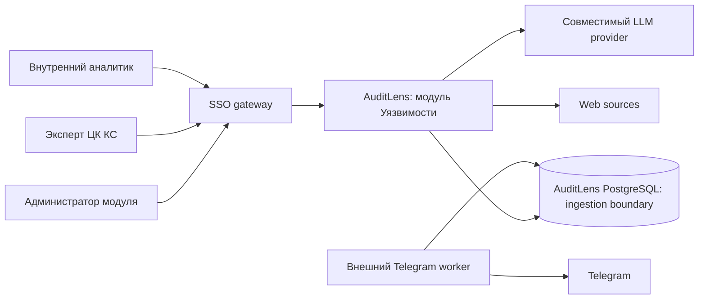
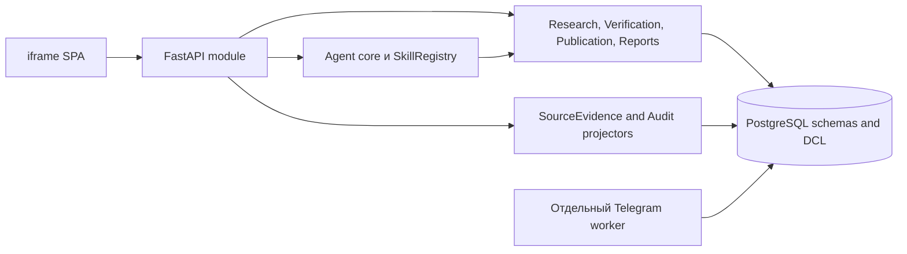
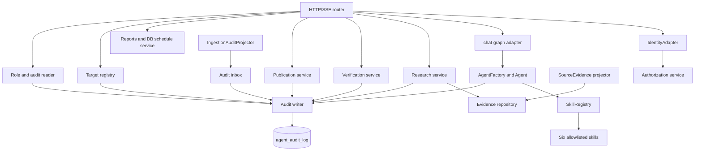
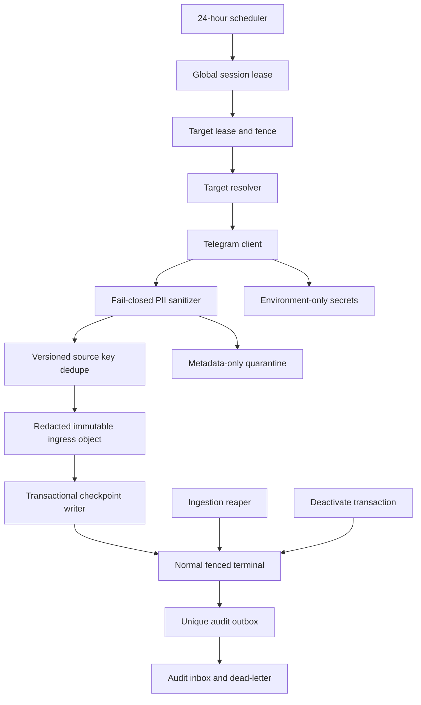
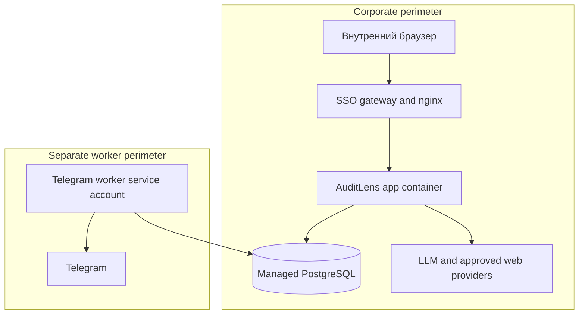

# C4-набор — модуль «Уязвимости»

**Статус:** TO-BE. Существующий monolith и parser scheduler не подтверждают реализацию ниже; RBAC, DCL, worker и runtime boundary имеют статус **UNVERIFIED**.

## C1. Контекст

Gateway и `IdentityAdapter` выдают проверенный OIDC Principal. Telegram worker не является UI-пользователем, дочерним процессом AuditLens или владельцем каталога.

## C2. Контейнеры

| Container | Ответственность | Запрещённое владение |
| --- | --- | --- |
| iframe SPA | Раздельные маршруты каталога, исследования и очереди; DTO | прямой доступ к БД, правила публикации, Telegram secrets |
| FastAPI | OIDC subject, authoritative membership/RBAC, HTTP/SSE, доменные команды и queries | Telegram session и Telegram scheduler |
| Agent core | ReAct, лимит 20, skills, audit lifecycle | direct SQL write и публикация без domain service |
| Domain services | research, verification, publication, export, typed DB schedules | UI state и worker secrets |
| Projectors | ingress claim -> revisioned evidence; worker attempt -> audit summary | создание research/case и чтение full payload |
| PostgreSQL | domain, ingestion, outbox, DCL and constraints | LLM reasoning и business authorization |
| Telegram worker | one session, mask, fence, checkpoint, immutable attempt/object journal | evidence, research, catalog, decision, audit log |

## C3. Компоненты AuditLens

## C3. Компоненты внешнего Telegram worker

Generation-bound fencing rejects a stale writer. Attempt header persists `initial_checkpoint(sequence=0,cursor=null)` before any Telegram read. `resolver_only` uses the same attempt/terminal/outbox path: fenced `resolve_provisional_target` can promote/merge and terminalize only that `attempt_id`; separate registry outbox does not exist. Deactivation transaction, not a stale worker, terminalize-ит running attempt того же generation и создаёт unique outbox; `ingestion_reaper` закрывает zero-batch или crash/lease-expiry attempt. Inbox сохраняется весь 30-day delivery horizon; quarantine хранит только allowlisted opaque metadata, keyed source fingerprint and immutable sanitizer result.

## C4. Deployment and trust boundaries

| Principal | DB path | Network path |
| --- | --- | --- |
| `auditlens_app` | domain repositories, separate target registration/access services and controlled functions | gateway/app to PostgreSQL and approved providers |
| `loophole_readonly` | allowlisted views only | used only by DB skill execution |
| `telegram_worker` | active-target view, fenced ingestion and `resolve_provisional_target` function | TLS to PostgreSQL and Telegram only; no inbound listener or direct table write |
| `ingestion_reaper` | expired-attempt terminal function and age view only | scheduled internal job; no payload, catalog or audit-log access |
| `audit_retention` | bounded audit/ingestion purge functions and aggregate runs | scheduled internal job only; no payload read |

Worker image provenance, secret injection/rotation, CA/TLS, firewall egress, privilege-deny test and alert owner are mandatory staging evidence. Their existence is not inferred from this diagram.
