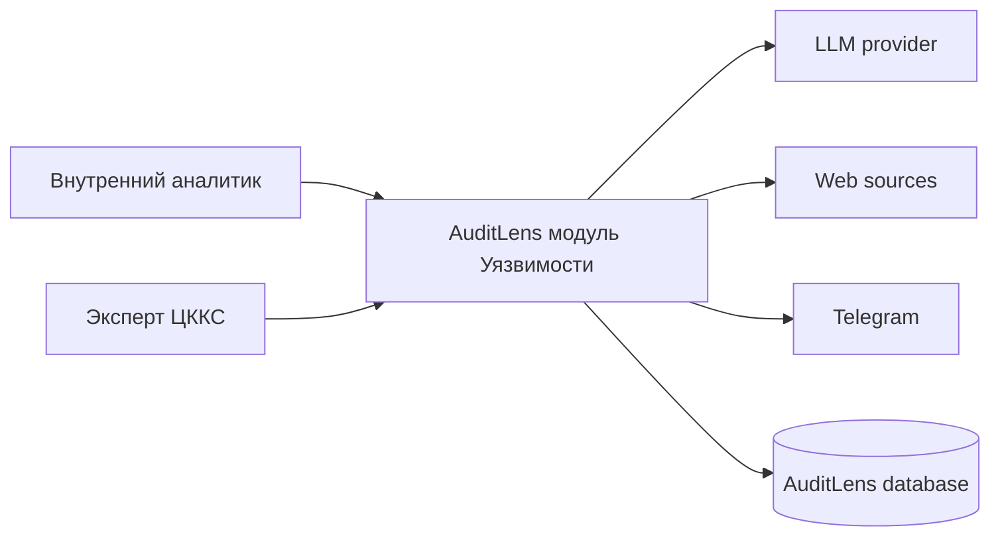
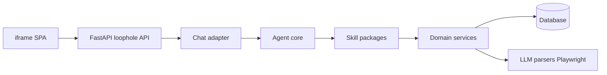
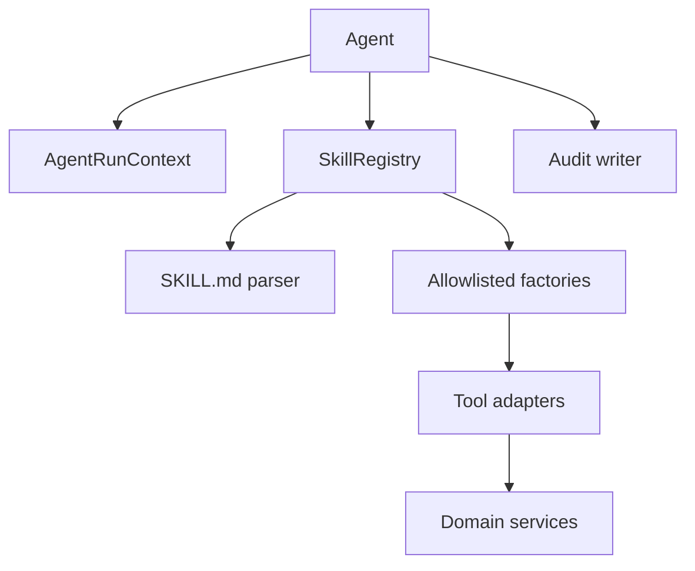

# C4-набор — агент лазеек

## C1. Контекст

```mermaid
flowchart LR
  Analyst[Внутренний аналитик] --> AL[AuditLens модуль Уязвимости]
  Expert[Эксперт ЦККС] --> AL
  AL --> LLM[LLM provider]
  AL --> Web[Web sources]
  AL --> TG[Telegram]
  AL --> DB[(AuditLens database)]
```

## C2. Контейнеры

```mermaid
flowchart LR
  UI[iframe SPA] --> API[FastAPI loophole API]
  API --> Chat[Chat adapter]
  Chat --> Agent[Agent core]
  Agent --> Skills[Skill packages]
  Skills --> Services[Domain services]
  Services --> DB[(Database)]
  Services --> Providers[LLM parsers Playwright]
```

## C3. Компоненты `agent/`

```mermaid
flowchart TD
  Agent[Agent] --> Context[AgentRunContext]
  Agent --> Registry[SkillRegistry]
  Agent --> Audit[Audit writer]
  Registry --> Manifest[SKILL.md parser]
  Registry --> Factories[Allowlisted factories]
  Factories --> Tools[Tool adapters]
  Tools --> Services[Domain services]
```
