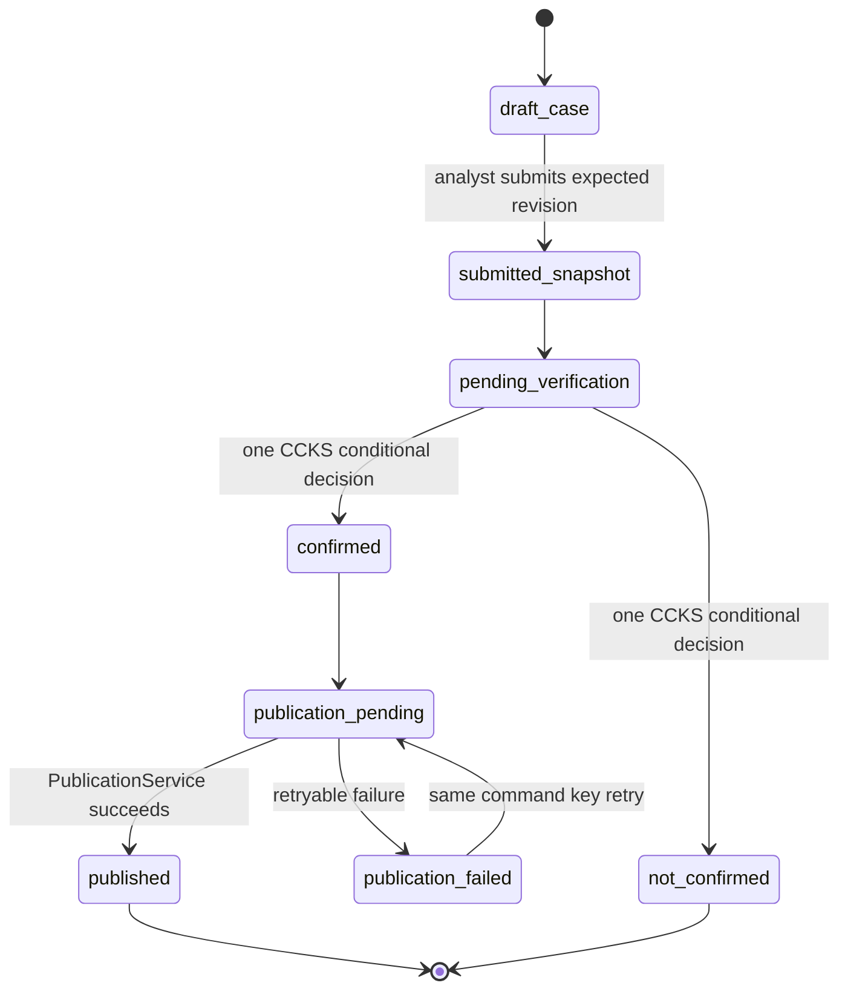
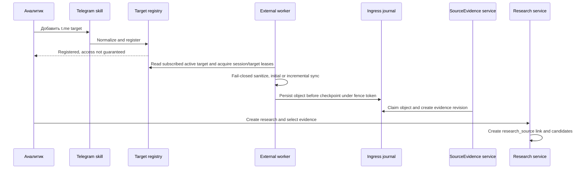

# Решение: управляемый цикл модуля «Уязвимости»

## Статус

Это утверждённый **TO-BE** дизайн. Текущий direct-save в `loophole_record`, in-process parser scheduler, RBAC, DCL, миграции lifecycle и отдельный Telegram worker не являются доказательством реализации. Runtime evidence для этих границ: **UNVERIFIED**.

## Утверждаемое решение

AuditLens остаётся модульным монолитом для пользовательских контекстов, agent skills, исследования, верификации, публикации и экспорта. Telegram выносится в отдельно развёрнутый worker, который владеет единственной Telegram-сессией и записывает PII-masked ingress objects. AuditLens превращает ingress objects в redacted evidence, а аналитик явно выбирает evidence для изолированного исследования. Управляемый цикл: источник -> evidence -> изолированное исследование -> очередь ЦК КС -> детерминированная публикация -> каталог.

## Границы ответственности

| Граница | Владеет | Не делает |
| --- | --- | --- |
| Research service | параметры запуска, кандидаты, связи с revisioned evidence, research export | не публикует общий каталог |
| Verification service | immutable submitted snapshot evidence revisions, очередь, решение ЦК КС | не изменяет модельный или ручной verdict автоматикой |
| Publication service | idempotent mapping и связь с каталогом | не принимает решение за эксперта |
| Catalog service | поиск, фильтр и export опубликованных кейсов | не показывает неподтверждённые кандидаты |
| Agent core | ReAct, skills, SSE и audit lifecycle | не использует write SQL или Telegram session |
| External Telegram worker | deployment `telegram_session_id`, sync, sanitized ingress object, checkpoint и 24-hour SLO | не пишет research, evidence, решение, каталог или `agent_audit_log` |
| SourceEvidence service | claimed ingress object -> append-only evidence revision, quarantine | не создаёт research/case/verification автоматически |
| IngestionAuditProjector | exactly-once attempt summary -> domain audit | не читает full payload и не меняет business state |

## Жизненный цикл кейса

1. `ResearchService` создаёт `loophole_research`, связи с redacted evidence и `research_case`. Кейс видим только в контексте исследования.
2. Classifier может добавить модельный verdict. Ручная маркировка аналитика и решение ЦК КС сильнее автоматического результата.
3. Аналитик submit-ит expected case revision. Сервис создаёт `submitted_case_revision` с immutable evidence revision ids и HMAC fingerprints, actor, time и namespaced command key. Одна submitted snapshot допустима на `(research_case_id, revision)`; мутация snapshot запрещена.
4. Эксперт ЦК КС фиксирует одно conditional решение для `pending` snapshot. Уникальный constraint не допускает второе final решение; конкурент получает уже сохранённый final result без нового side effect.
5. Положительное решение фиксирует `case_type` и создаёт `publication_pending`. `PublicationService` использует тот же `publication` command key и unique publication mapping. `CaseFingerprint v1` является SHA-256 canonical JSON версии, case type, bank/product scope, category и sorted evidence HMAC; только exact match связывает новую provenance с существующим каталогом. Fuzzy match никогда не сливается автоматически.

| Field | Канонический namespace |
| --- | --- |
| `research_case.lifecycle_status` | `draft|submitted` |
| `verification_status` | `not_submitted|pending|confirmed|not_confirmed` |
| `verification_decision.kind` | `vulnerability|fraud_scheme|not_confirmed` |
| `publication_status` | `not_published|pending|published|failed` |

## Данные и constraints

| Entity | Владелец | Constraint |
| --- | --- | --- |
| `loophole_research` | Research service | actor, workspace, query and `run_id` |
| `research_case` | Research service | candidate never equals catalog |
| `submitted_case_revision` | Verification service | unique `(research_case_id, revision)` and immutable evidence revision snapshot |
| `verification_decision` | Verification service | one final decision per submitted revision, append-only |
| `publication_mapping` | Publication service | one mapping per confirmed decision, retry uses same `publication` command key |
| `loophole_record` | Publication service | only published confirmed cases; exact-fingerprint provenance links allowed |
| `telegram_monitoring_target` | Target registry | global canonical identity; workspace access via subscription, target generation and active/inactive |
| `telegram_ingestion_attempt/batch/terminal` | External worker | append-only worker journal, `worker_run_id`, fence, counters and checkpoint |
| `telegram_ingestion_object` | External worker | sanitizer-approved identity/version/HMAC, no full raw body |
| `source_evidence/source_evidence_revision` | SourceEvidence service | unique origin object, append-only redacted projection/revision and provenance |
| `agent_audit_log` | Audit writer | append-only redacted application events, 14-day retention |

Новые миграции должны быть следующими по номеру после существующих SQL-файлов, идемпотентными и содержать DDL/DCL: `042_loophole_case_lifecycle.sql`, `043_loophole_telegram_ingestion.sql`, `044_loophole_audit_security.sql`.

## Telegram ingestion

`TelegramObjectIdentity v1` состоит из logical account, canonical peer, message, optional comment и revision; target registry сначала idempotently создаёт active provisional target по normalized alias без membership/access, а worker выполняет для него resolver-only attempt/availability audit в 24-hour SLO. Resolver atomically promotes его к canonical peer или при conflict переносит subscriptions/alias history к existing target и оставляет redirect alias; acquisition/checkpoint/evidence принадлежат только canonical target. Global target связывается с workspace через subscription; worker собирает target один раз, а research может выбрать evidence только при active subscription своего workspace. Worker использует global session lease на deployment `telegram_session_id` и target lease с generation-bound fencing token. Каждый batch атомарно сохраняет deduplicated objects, batch event и checkpoint при совпадении token/generation. Normal terminal event и unique audit outbox коммитятся одной fenced transaction; deactivate terminalization выполняет registry transaction. Reactivate сохраняет checkpoint и продолжает корректный initial/incremental путь.

Worker не создаёт research, candidate, verification request или каталог. Ingress object проходит `new|processing|linked|retryable_failed|quarantined` с claim token/expiry; reaper reclaim-ит только истёкшие claims до retention cutoff. Unique `origin_ingestion_object_id` не допускает два evidence. Current regex `pii_mask` не является достаточной гарантией: versioned sanitizer обязан fail-closed quarantine-ить metadata-only object при detector error, uncertain result или unsupported attachment. Replacement map остаётся только в памяти. Только sanitizer-approved redacted projection и keyed HMAC могут попасть в persistence и LLM. Full raw body не хранится. Unlinked ingress object удаляется через 14 дней.

## Точные контракты отказа и replay

`active(g) -> inactive(g+1)` выполняется registry transaction, сериализованной с fenced batch/checkpoint writes. Она сама terminalize-ит каждую non-terminal attempt поколения `g` кодом `target_deactivated` и создаёт unique outbox; worker с прежним fence только останавливается. Attempt header atomically содержит durable `initial_checkpoint(sequence=0,cursor=null)` до Telegram read, поэтому `ingestion_reaper` terminalize-ит любой attempt с истекшим lease, включая crash после header до первого batch, как `lease_expired|abandoned`; после этого разрешён failover. У terminal, outbox и audit summary один `attempt_id`: unique terminal/outbox исключает второй результат.

`TelegramMonitoringTarget v1` принимает `t.me`, `@alias` или invite input и configured non-secret `logical_account_id`, нормализует адрес и idempotently создаёт active provisional target до membership/access. Resolver-only attempt не позднее 24 часов фиксирует availability. Serializable resolver затем получает immutable remote peer ID и atomically promotes provisional record к canonical target или при unique conflict переносит subscriptions/alias history в existing canonical target, оставляя redirect alias. Поэтому alias, rename, peer migration и concurrent registration не создают второй acquisition, checkpoint или поток evidence.

Telegram skill не вызывает worker и меняет только target registry: `TargetRegistryService.register_target` от authorizованного principal в одной transaction reservation-ит `target_registration` command key, dereference-ит alias index до canonical root и creates/returns only `TelegramMonitoringTarget v1`; `workspace_subscription`, lifecycle и membership этим вызовом не меняются. `TargetAccessService.grant_workspace_subscription` является отдельной управляющей operation: только active `module_admin` с workspace capability `target_subscription_manage` может reservation-ить `target_subscription` key, dereference-ить canonical logical root и upsert-ить unique active `workspace_subscription(workspace_id,canonical_target_id)` с `grant_version/intent_sequence`; guard отвергает redirect/cross-workspace/capability failure. Grant допустим до remote resolution, но selection требует active grant plus successfully ingested evidence. Matching `revoke_workspace_subscription` имеет тот же RBAC/lock path, increment-ит grant version и использует AD-31 semantics. Worker вызывает только DCL-limited SECURITY DEFINER `resolve_provisional_target(target_id,generation,resolver_fence_token,attempt_id,remote_peer_id)`, которая проверяет fenced `resolver_only` attempt, serializably merge-ит target и existing subscriptions по latest explicit intent, terminalize-ит ту же attempt и пишет её unique audit outbox. Target paths lock alias index by normalized address, target rows by UUID, attempt by UUID, subscriptions by workspace UUID and outbox last; registration/subscription reservation precedes this suffix. Deadlock/serialization retry is typed and reuses the same key/fence. У worker нет FastAPI transport, direct table write, catalog/research/audit-log grants.

`CommandLedger v1` сохраняет namespace/key, canonical request SHA-256, state и immutable result reference/hash. Разный payload с тем же key получает `idempotency_payload_mismatch`, одинаковый получает terminal result или `idempotency_in_progress`; side effect повторно не выполняется. Evidence HMAC хранится только как `{algorithm, hmac_key_id, digest}`. Rotation не переписывает revision: legacy keys остаются verify-only, active key создаёт только новую revision; optional re-HMAC всегда создаёт новый snapshot. `CaseFingerprint v1` равен SHA-256 UTF-8 canonical JSON: schema version, case type, `catalog_scope=global`, normalized `bank_id`, `product_id`, `category_id`, taxonomy version и lexicographically sorted full evidence fingerprint objects. Keys sort лексикографически, strings NFC+trim, normalized IDs lowercase ASCII; `null` означает not-applicable, `unknown` -- known-unknown. Только same key-id/digest exact equality создаёт provenance link; golden fixtures обязательны.

Active workspace subscription нужна для evidence selection и draft submission. Selection/submit serializably берут active subscription row `FOR UPDATE` и pin-ят `subscription_id/grant_version` как immutable `evidence_access_grant` submitted snapshot. Revoke берёт тот же lock и increment-ит grant version: draft более не submit-ится до re-subscribe и new explicit selection, а snapshot уже admitted до revoke сохраняет grant. Поэтому decision, обязательная automatic publication positive decision и idempotent retry такой snapshot продолжаются по FR-12.4; race имеет единственный serial order и audit. Evidence completion/failure -- один CAS по `claim_token`, unexpired `claim_expires_at` и `processing`; stale projector получает `claim_lost` без mutation.

`SanitizationResult v1` immutable: policy version/config digest, outcome, closed reason code, input/media type, parser version и approved-projection fingerprint. Любое изменение parser/config требует новой policy version; replay quarantine создаёт новую object revision с audit. `QuarantineMetadata v1` разрешает только opaque IDs, keyed `{algorithm,hmac_key_id,digest}` source-identity fingerprint, UTC time, size, fixed media/reason codes и policy identifiers. Plain/hash-only digest, body, caption, filename, URL, peer title, preview, OCR/error text и arbitrary strings запрещены в нём, логах и persistence.

Attempt header/batch/terminal хранятся 90 дней. Outbox/inbox сохраняются не менее 31 дня после terminal, delivery horizon -- 30 дней. Undelivered outbox после 7 дней попадает в redacted dead-letter с alert; replay разрешён по immutable `outbox_id` до horizon. После horizon поздняя доставка возвращает `expired_outbox` без audit mutation. `audit_retention` вызывает только bounded `purge_ingestion_journal_before` с проверкой terminal/horizon, batch limit и aggregate `ingestion_retention_run`; payload не читается. Это сохраняет inbox dedupe дольше 14-day retention самого `agent_audit_log`.

## API, RBAC и scheduled DB skill

| Контекст | Команды | Queries |
| --- | --- | --- |
| Каталог | export, допустимая ручная маркировка | `ReportFilter(scope=catalog)` только published confirmed cases |
| AI-исследование | create research, stream agent, select evidence, submit candidate | `ReportFilter(scope=research, research_id=...)` |
| Очередь ЦК КС | decide vulnerability/fraud/not_confirmed | pending immutable snapshot, evidence and provenance |
| Администрирование | назначить/отозвать ЦК КС, activate/inactivate target | audit summary, target status and 24-hour SLO |
| Scheduled DB task | enable/disable named analytical schedule | allowlisted named query/ReportFilter, workspace, service actor, expiry |

`IdentityAdapter` проверяет OIDC JWT по pinned issuer, audience и JWKS и создаёт immutable `Principal(subject_id)`. Workspace membership и roles берутся только из database authorization store и перепроверяются при каждом endpoint/tool и каждом scheduled run; token не переносит trusted workspace/role grant. Роль ЦК КС назначает администратор модуля; максимум пять активных назначений, второй шаг в v1 отсутствует. `ScheduledQueryContract v1` не хранит raw SQL: он pin-ит named query ID/version, workspace, owner, result owner и expiry. Scheduler запускает его только если оба subject являются active members contract workspace, owner имеет capability `db_schedule_execute` для query version, result owner имеет `scheduled_result_read`, а expiry не наступил. Иначе один `schedule_skipped_<reason>` audit event создаётся без query. `ScheduledResult v1` хранится только во внутреннем private destination того же workspace, имеет ACL из owner/result owner, TTL <=24 часов и correlation run; external, foreign-workspace и automatic export запрещены.

## Security и audit

- `auditlens_app`, `loophole_readonly`, `telegram_worker`, `ingestion_reaper` и `audit_retention` являются раздельными database principals. `ingestion_reaper` имеет только expired-attempt terminal function и attempt-age view без payload. Матрица grants, worker perimeter и staging evidence находятся в `SECURITY-AND-OPERATIONS.md`.
- Worker journal является каноническим журналом синхронизации. Fenced terminal transaction вставляет unique outbox per `attempt_id`. `IngestionAuditProjector` доставляет at-least-once, но в одной transaction вставляет unique inbox и redacted `agent_audit_log` summary по `(worker_run_id, attempt_id)`, поэтому наблюдаемый audit event exactly-once; worker не получает audit grant.
- `agent_audit_log` append-only для application roles. Daily `audit_retention` job вызывает bounded purge function для записей старше 14 дней, пишет aggregate run и alert при failure.
- До LLM вызова и persistence применяется fail-closed versioned sanitizer. Secrets, session material, full prompt, raw LLM output, replacement map и full Telegram payload не хранятся. Detector error, uncertainty и unsupported attachment карантинируют metadata-only object и не имеют LLM/evidence path.

## Migration и cutover от текущего состояния

Текущий модуль сохраняет agent result в `loophole_record`, а scheduler обычных parser-ов работает в FastAPI-процессе. Это **AS-IS baseline**, не целевое поведение.

1. Добавить lifecycle, evidence, verification, publication, target, ingestion, audit/DCL migrations с repository contracts и PostgreSQL grant tests.
2. Переключить `save_loophole` на `ResearchService`: automated cutover check запрещает reachable `INSERT/UPDATE loophole_record` вне `PublicationService` и migration/repository implementation. Пока legacy path reachable, CAP-3/CAP-4 target не считается включённым.
3. Ввести OIDC `IdentityAdapter`, role assignment, verification/publication routes и три UI context.
4. Ввести внешний worker, DCL, lease/checkpoint/fence/claim tests и deployment perimeter. Не использовать `parsers/scheduler.py` для Telegram.
5. Завершить Agent/Skill migration. Удаление `tools_nanobot.py` разрешено только после SM-2/SM-4.1, no-import check, отсутствия dual-write и rollback evidence.

## Операционная готовность

| Signal | Цель | Реакция |
| --- | --- | --- |
| Telegram attempt age | каждая active target имеет attempt не старше 24 часов | alert владельцу worker-а, fencing-aware retry |
| Lease/fence conflict | stale writer не может сохранить batch или checkpoint | terminal attempt code, no state advance |
| Duplicate source key | ноль duplicate evidence/case/publication | unique constraint, provenance link or quarantine |
| Publication failure | ни один confirmed case не теряется | `publication_failed`, same command key retry |
| Audit retention | отсутствуют events старше 14 дней | privileged job, aggregate run and alert |
| Agent progress | первый SSE phase/progress <=15 сек | typed terminal error, run_id для расследования |

## Непосредственные зависимости

UX для трёх отдельных контекстов ещё не описан в текущих UX-артефактах. Frontend CAP-1--CAP-4 не считается готовым до UX update. Staging/production evidence, перечисленный в security contract, остаётся UNVERIFIED до реализации и не заменяется этим документом.
