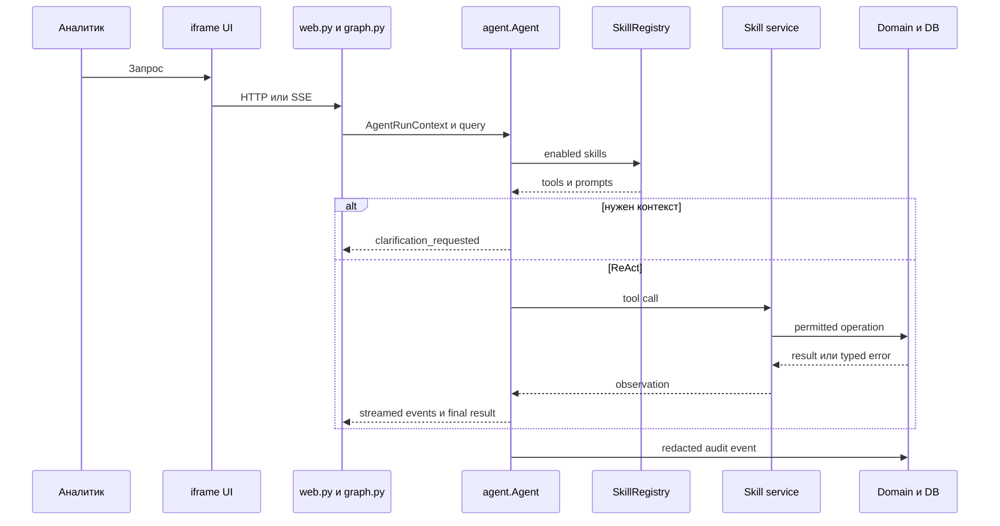

# Решение: рефакторинг агента лазеек

## Цель

Сохранить HTTP/SSE-поверхности чата, заменив монолитные tools на шесть изолированных skills. Новая `agent.Agent` владеет ReAct-циклом, уточнениями, лимитом итераций и аудитом; legacy служит только проверяемым мостом миграции.

## Поток выполнения

## Skills

| Skill | Операции | Владелец записи |
| --- | --- | --- |
| `web-search` | search, fetch, extract, save | `save_loophole` |
| `parser-creator` | create, run, status, schedule | parser service |
| `telegram-parser` | normalise target, create parser | parser service; секреты из env |
| `db` | validated SELECT, table load | нет мутаций |
| `reports` | CSV/XLSX/PDF по `ReportFilter` | нет мутаций |
| `loophole-classifier` | one/batch classify | classifier service |

## Миграция и удаление legacy

1. Создать core, registry и шесть skills; оставить `tools_nanobot.py` shim.
2. Перевести `graph.py` на `agent.Agent`, не меняя публичные сигнатуры и SSE events.
3. Прогнать тесты clarification, max-iterations, skills, errors, records/SSE, экспорт и защиту ручного verdict.
4. Сравнить legacy и новую реализацию на зафиксированных транскриптах SM-2 и SM-4.1.
5. Удалить shim, только когда все тесты зелёные, прямые импорты отсутствуют, а ruff не добавляет ошибок.

## Эксплуатация

- `config.json`: allowlist, лимит 20, batch classifier 50 и workspace.
- Env имеет более высокий приоритет и хранит только deployment-specific значения.
- `agent_audit_log` хранит redacted события; пользовательские действия остаются в `loophole_action_log`.
- Staging проверяет миграции и браузер; PDF без браузера даёт объяснённую ошибку.
